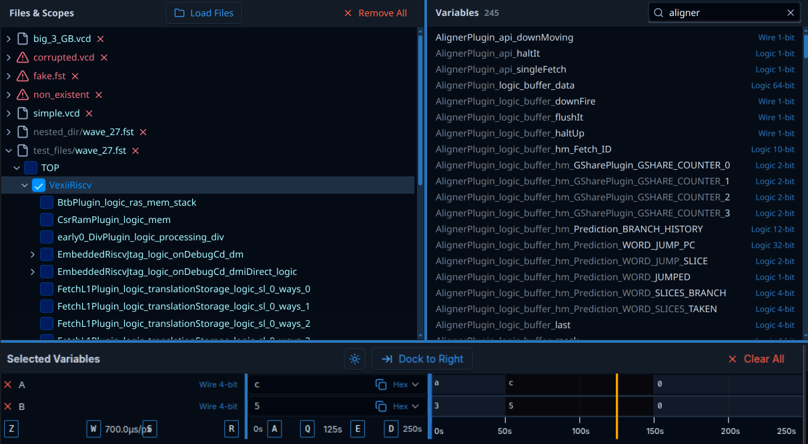
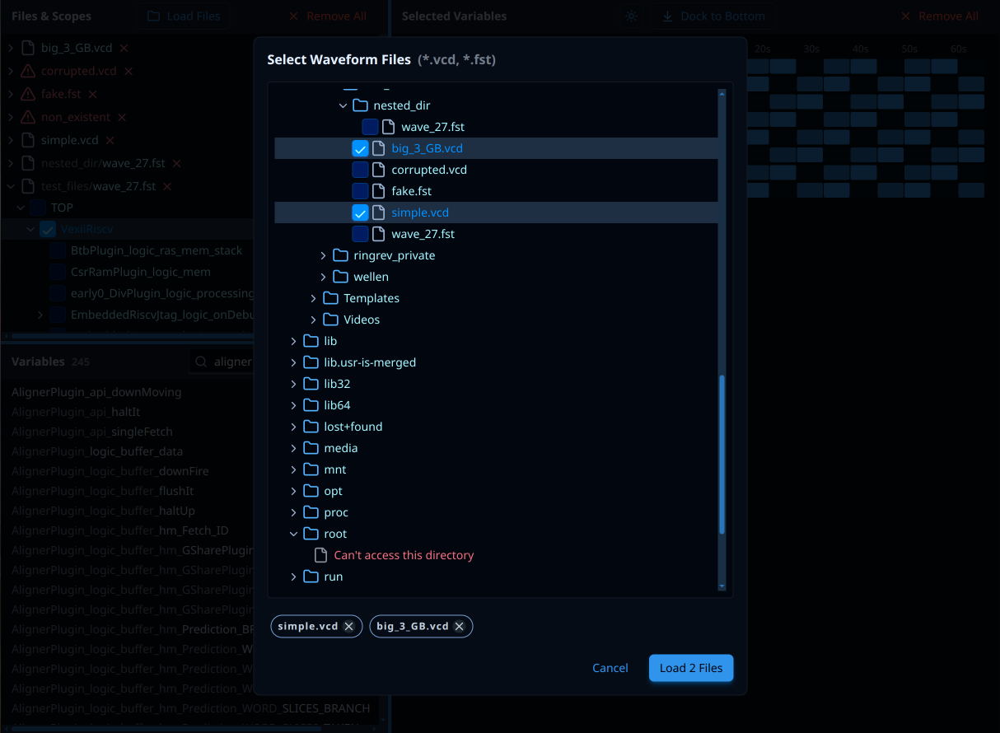
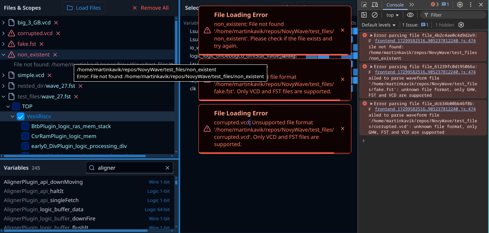

# NovyWave Specifications



NovyWave is an open-source waveform viewer designed as a modern alternative to GTKWave.

This cross-platform desktop application is suitable for both professionals and beginners, offering simple installation and a strong focus on user experience. Its goal is to boost productivity and satisfaction among current hardware developers while also attracting new developers and students to the hardware design ecosystem. NovyWave is built on fast and reliable Rust libraries and leverages well-proven web technologies to ensure a consistent look, accessibility, design flexibility, and safe user extensibility via WebAssembly plugins.

# Layout and Styles

The layout consists of 3 panels divided by draggable lines. "Files & Scopes" panel at the top left corner, "Variables" panel in the top right corner, and "Selected Variables" panel at the bottom. Users can drag the draggable divider lines with their mouse cursors to resize panels (tiling).

The layout can be changed by clicking button "Dock to Right" as follows: "Files & Scopes" panel does not move at all, "Variables" panel move to the left bottom corner below "Files & Scopes" panel and "Selected Variables" panel move to the rigth side - it will be _docked_ along whole right edge of the window.

After clicking on button "Dock to Right", the button label will change to "Dock to Bottom" - after clicking it again panels will move to the default layout (bottom dock mode). Users can toggle between the two dock modes with this button or by pressing Ctrl+D shortcut.
The button is placed in the "Selected Variables" panel header. 

Dragging should work the way that after clicking on a draggable line a transparent overlay is rendered over entire window and that overlay listens for mouse events to prevent accidental content selection and it makes the algorithm simpler and more reliable in general.

Both dock mode (right/bottom) has to be stored together with dividing bar positions (individually for each dock mode) in .novywave on each dock mode change or resize (debounced properly).

All panels have thin inside scrollbars (both vertical and horizontal as the content dictates) and all containers and elements have minimal paddings and sizes to accomodate many waveform variables with long names and to provide as much information to the user as possible at once to help with debugging effectively. Sans-serif font(s) for most parts of application, monospaced font(s) for waveform variable values and inside canvas with waveform visualizer.

Dark and light themes are supported with no customization options. The dark theme is the default and themes can be switched by clicking the Theme Button in the Selected Variables panel header or by pressing shortcut Ctrl+T. The theme system uses fixed color palettes optimized for waveform visualization and is designed for simplicity rather than customization.

# Configuration Management

NovyWave automatically saves and restores application state through a configuration system that supports both development and production environments.

## Configuration Storage

### Development Mode
During development and testing, configuration is stored in `.novywave` file in the project root directory. This file is version-controlled with git to ensure consistent development experience across the team.

### Production Mode
In production builds, configuration is stored in Tauri's default user storage location following platform conventions:
- **Windows**: `%APPDATA%/com.novywave.app/`
- **macOS**: `~/Library/Application Support/com.novywave.app/`
- **Linux**: `~/.config/novywave/`

### Per-Project Configuration
Like Cargo.toml for Rust projects, NovyWave supports per-project configuration. When a `.novywave` file exists in the current working directory, it takes precedence over the global user configuration.

### Global Workspace History
Open Workspace dialog state (recent workspaces, last selection, tree view scroll and expansion data) is persisted separately from per-project config in a `.novywave_global` file. During development this file lives alongside the repo; in production it is stored in the same platform-specific directory as the main app config (e.g., `~/.config/novywave/.novywave_global` on Linux). The history is capped at three recent entries and replaces the legacy `recent_workspaces.json` store.

## Configuration Format

The configuration is stored as TOML format with the following structure:

```toml
[workspace]
dock_mode = "Bottom" # "Right" or "Bottom"
theme = "Dark" # "Dark" or "Light"

[files]
tracked_files = ["/path/to/file1.vcd", "/path/to/file2.fst"]

[scope]
selected_scope_id = "file1.vcd|TOP|cpu"
expanded_scopes = ["file1.vcd|TOP", "file2.fst|testbench"]

[variables]
selected_variables = [
    {id = "file1.vcd|TOP|cpu|clk", formatter = "Bin"},
    {id = "file1.vcd|TOP|cpu|data", formatter = "Hex"}
]
variable_filter = ""

[panels]
[panels.right_mode]
files_panel_width = 300
variables_panel_width = 400
timeline_panel_height = 600
variables_name_column_width = 150
variables_value_column_width = 100

[panels.bottom_mode]
files_panel_width = 300
files_panel_height = 350
variables_panel_width = 400
variables_name_column_width = 150
variables_value_column_width = 100

[timeline]
cursor_position_ns = 125000000 # nanoseconds
zoom_center_ns = 0
zoom_level = 1.0
visible_range_start_ns = 0
visible_range_end_ns = 250000000

[dialogs]
[dialogs.file_picker]
scroll_position = 0
expanded_directories = ["/home/user", "/home/user/projects"]

[global.workspace_history]
last_selected = "/home/user/repos/NovyWave"
recent_paths = [
  "/home/user/repos/NovyWave",
  "/home/user/projects/example"
]

[global.workspace_history.tree_state."/home/user/repos/NovyWave"]
scroll_top = 128.0
expanded_paths = [
  "/home/user/repos/NovyWave/hardware",
  "/home/user/repos/NovyWave/test_files"
]

[errors]
toast_auto_dismiss_ms = 5000
```

## Auto-Save Behavior

Configuration is automatically saved to disk with proper debouncing to prevent excessive file writes:

- **Panel resizing**: 500ms debounce after drag operation completes
- **Variable selection**: Immediate save on selection change
- **Timeline navigation**: 1000ms debounce for cursor/zoom changes
- **Dialog interactions**: Immediate save for expand/collapse states
- **Theme/dock changes**: Immediate save

## Error Handling

When configuration file cannot be read:
- Display error message: "Configuration file is corrupted: '[specific error]'. Please fix the file or remove '[absolute path]' to reset settings."
- Fall back to default configuration values
- Do not retry loading automatically - user must fix or remove corrupted file

# Files & Scopes Panel

## Header

Title "Files & Scope" aligned left, "Load Files" button with a folder icon in the center and "Remove All" button with "x" icon aligned right.

"Remove All" button clear the panel content by removing all loaded files. A standarized (the same for all empty states in all panels) placeholder text like "Click Load Files and choose files to open" appears.

"Load Files" button opens file picker (described below in section "Load Files Dialog") to pick VCD, FST and GHW files. After succesful selection (1 or more files), the files will be loaded and displayed in the panel content as described below. For debug pursposes, file picker should open in `test_files` folder by default.

# Data Loading & Performance

NovyWave is designed to handle large waveform files efficiently through smart data loading and decimation strategies.

## Loading Strategy

### File Parsing
- Wellen library parses only file headers by default (fast operation)
- Time span and units extraction may take hundreds of milliseconds to seconds for large files
- Brief "Loading..." indicator shown during header parsing
- Full signal data loaded on-demand when needed for visualization

### Request-Response Format
Frontend requests timeline data with specific parameters:
```javascript
{
  canvas_width_px: 1200,
  time_range: {
    start_ns: 1000000,  // nanoseconds
    end_ns: 5000000     // nanoseconds
  },
  variables: [
    {id: "file1.vcd|TOP|clk", formatter: "Bin"},
    {id: "file1.vcd|TOP|data", formatter: "Hex"}
  ]
}
```

Backend responds with decimated signal data:
```javascript
{
  variable_id: "file1.vcd|TOP|clk",
  transitions: [
    {time_ns: 1000000, value: "0"},
    {time_ns: 1500000, value: "1"},
    {time_ns: 2000000, value: "0"}
  ]
}
```

## Data Request Optimization

### Batching Strategy
- **Initial load**: Bundle requests for all selected variables
- **Adding single variable**: Request only new variable data (incremental)
- **Timeline range change**: Bundle all visible variables
- **Cursor outside visible range**: Bundle all variables for cursor values

### Backend Optimizations
- Leverage Wellen library native optimizations
- Utilize multithreaded processing on backend
- Operate with larger RAM capacity on backend side
- Keep frontend data transfers minimal

## Decimation Algorithm

### Peak-Preserving Decimation
To ensure no important signal transitions are lost, use min/max decimation:

1. **Divide timeline into pixel-aligned buckets** (one per display pixel)
2. **For each bucket**, find:
   - Minimum value in time range
   - Maximum value in time range
   - First transition time
   - Last transition time
3. **Preserve critical transitions**:
   - Single-pixel pulses must remain visible
   - Setup/hold violations must be preserved
   - Edge cases (very short pulses) shown as minimum 1px blocks

### Algorithm Example
For timeline 0-250s displayed in 800px canvas:
- Each pixel represents ~312ms
- If signal has 0→1→0 transition in 1ns within a pixel bucket
- Show as distinct transition blocks to maintain visibility
- Use bright contrasting colors for single-pixel critical events

## Performance Targets

The application should maintain smooth interaction with mixed timescales:
- **Panning**: Smooth scrolling with simple.vcd and wave_27.fst loaded
- **Zooming**: Responsive zoom with keyboard shortcuts (W/S keys)
- **Cursor movement**: Real-time updates when holding Q/E keys
- **Timeline ticks**: Dynamic unit formatting without layout breaks

### Memory Management
- Backend handles all large dataset operations
- Frontend maintains minimal working set (visible data only)
- No caching of formatted values - format in real-time
- Request throttling for smooth cursor movement operations

# Internal Data Representation

NovyWave uses consistent internal data types and formatting strategies to handle the wide range of time scales and maintain precision across operations.

## Time Representation

### Internal Storage
All time values are stored internally as **nanoseconds using u64 type**:
- Cursor position: `cursor_position_ns: u64`
- Timeline bounds: `start_ns: u64`, `end_ns: u64`
- Zoom center: `zoom_center_ns: u64`
- Signal transitions: `time_ns: u64`

### Precision Benefits
Using nanoseconds as the base unit provides:
- **No precision loss** during zoom/pan operations
- **Consistent behavior** across different timescales
- **Integer arithmetic** avoiding floating-point errors
- **Wide range support** from nanoseconds to hundreds of seconds

### Example Internal Values
```rust
// 250 seconds timeline
let timeline_end_ns: u64 = 250_000_000_000; // 250s in nanoseconds

// Cursor at 125 seconds
let cursor_position_ns: u64 = 125_000_000_000; // 125s in nanoseconds

// 16 nanosecond timeline
let short_timeline_ns: u64 = 16; // 16ns
```

## Dynamic Unit Formatting

### Runtime Unit Selection
Time values are formatted dynamically based on magnitude to maintain readable layouts:

```rust
fn format_time_with_unit(time_ns: u64) -> String {
    match time_ns {
        0..=999 => format!("{}ns", time_ns),
        1_000..=999_999 => format!("{:.1}μs", time_ns as f64 / 1_000.0),
        1_000_000..=999_999_999 => format!("{:.1}ms", time_ns as f64 / 1_000_000.0),
        _ => format!("{:.1}s", time_ns as f64 / 1_000_000_000.0),
    }
}
```

### Timeline Tick Formatting
Timeline footer ticks adapt units based on zoom level:
- **Zoomed out** (250s range): `0s 50s 100s 150s 200s 250s`
- **Medium zoom** (1ms range): `0.0ms 0.2ms 0.4ms 0.6ms 0.8ms 1.0ms`
- **Zoomed in** (100ns range): `0ns 20ns 40ns 60ns 80ns 100ns`

### Layout Preservation
Unit switching prevents layout breaks by:
- Maintaining consistent character width when possible
- Avoiding excessive decimal places
- Using appropriate unit prefixes (ns, μs, ms, s)
- Preventing number overflow in display areas

## Multi-File Time Alignment

### Common Time Base
When loading files with different time scales:
1. **Convert all timestamps to nanoseconds** during import
2. **Align to common zero point** (usually simulation start)
3. **Preserve original file timespans** for boundary calculations
4. **Handle unit mismatches** transparently in backend

### Example Alignment
```rust
// File A: 0-100ns with 1ns resolution
file_a.start_ns = 0;
file_a.end_ns = 100;

// File B: 0-1ms with 1μs resolution
file_b.start_ns = 0;
file_b.end_ns = 1_000_000; // 1ms in nanoseconds

// Combined timeline spans 0 to 1,000,000 ns (1ms)
let timeline_bounds = (0, max(file_a.end_ns, file_b.end_ns));
```

## Algorithm Precision

### Coordinate Calculations
Mouse-to-timeline position calculations use u64 arithmetic:
```rust
fn mouse_to_timeline_position(
    mouse_x: f32,
    canvas_width: f32,
    timeline_start_ns: u64,
    timeline_end_ns: u64
) -> u64 {
    let ratio = mouse_x / canvas_width;
    let range_ns = timeline_end_ns - timeline_start_ns;
    timeline_start_ns + (ratio as f64 * range_ns as f64) as u64
}
```

### Zoom Operations
Zoom calculations preserve precision by:
- Using u64 for all intermediate calculations
- Converting to f64 only for final display formatting
- Maintaining zoom center as fixed nanosecond position
- Avoiding cumulative floating-point errors

## Content

Panel content display a tree view with loaded files as roots. Loaded file is a file parsed by Wellen library. File labels in the tree view are formatted this way: "[chevron pointing right or down if expanded] [file icon or warning icon if parsing failed] [file name with extension, prefixed with path long enough to distinguish different files with same names] [timespan with units, e.g (0-250s)] ["x" remove (unload file) button]".
In case of loading error (file not found, parsing failed, not accessible, file not supported, etc.) the error message show be displayed as a tooltip on mouse hover together with absolute path to the file. Succesfully loaded files will have tooltip as well, but with just their absolute path. Files will be identified through entire app by their absolute paths.
Extra file path prefixes will have less contrasting colors than the filenames.
Files with loading errors will have differnt color as well. Timespan will be less contrasting than filenames.

File paths (absolute paths) are stored in the application configuration immediately after selection. Configuration is stored in `.novywave` file as TOML format and handles all application state including selected theme, dock mode, panel sizes, and more. Configuration handling is centralized for performance and consistency.

On application startup, the `.novywave` file is read and previously loaded files are automatically reloaded and displayed in the panel exactly as if they were selected manually through the file picker. This provides seamless session restoration for users.

Every file (tree view root item) can be expanded and display hierarchy of scopes as parsed by Wellen library. Expandable scopes (the one having at least one child scope) have dispalyed chevron icon just like files. Then the label contains bigger checkbox for easier pointer targeting. Only one checkbox may be selected in entire tree view and the corresponding selected scope is store in our .novywave file throuigh our central config handling with scope id, that has format "[absolute file path]|[scope parent]|[scope]". Expanded files and scopes are stored in config files similarly and restored properly after app restart. Scope is expanded by clicking everywhere on its label/row, excluding the checkbox (it's the only element toggling scope selection).
Files are ordered first by name then by unique prefix path (if present), scope are ordered just by name.
Panel content has to be scrollable both vertically and horizontally to acommodate deep scope hierarchy with often long names.

# Load Files Dialog



Load Files Dialog appears after clicking on Load Files button in the Files & Scope Panel header.

It's a modal dialog with semi-transparent overlay as the background behind the dialog window alone. Clicking on the overlay or pressing Esc key will close the dialog without any changes, similary to pressing button Cancel on the dialog alone.

The dialog consists of 4 parts:

## Header
Title "Select Waveform Files" with less contrasting "(*.vcd, *.fst, *.ghw)". There may be X button to close the modal but it's not necessary.

## Content
Scrollable content "window" with file tree view inside. It uses the same view component like the one that is used in the Files & Scope panel but the behavior is different.
The treeview represents basically standard file structure, where items are either directories or files or special placeholders described below.
**Scroll Position Persistence:**
- Scroll position is remembered in `.novywave` file under `[dialogs.file_picker]` section
- Position saving is debounced (500ms) to prevent excessive file writes during scrolling
- Restoring scroll position requires careful timing coordination with DOM rendering and tree data loading
- Position restoration should wait for initial tree structure to be rendered before applying scroll offset

### Directories
Item has format "[chevron right/down] [directory icon] [directory name]". They are expanded or collapsed on clicking anywhere on them or on the entire row that represents their containers. The tree starts with `/` in Linux and similar root or roots defined by their operating systems.

**Directory State Persistence:**
- Every expanded directory is stored in `.novywave` configuration file under `[dialogs.file_picker]` section
- Expansion state persists between dialog sessions and app restarts
- Only expanded directories are stored (collapsed directories are omitted for efficiency)

**Default Expansion:**
- On first dialog opening ever, home directory (`~` or equivalent) is automatically expanded
- All ancestor directories of home are also expanded to make content visible
- This provides immediate navigation context for new users

**Symbolic Link Handling:**
- Symbolic links to directories are treated transparently as regular directories
- Follow symlinks to show their target directory contents
- No special visual indication needed (keeps interface simple)
- If symlink target is inaccessible, show "Can't access this directory" placeholder 

### Files
File items have this layout and label: "[checkbox] [file icon] [filename]". Clicking anywere on the entire item row will toggle the checkbox and make the file item higlighted. Only supported file types are filtered and listed below their expanded parent directory. 

### Placeholders
There are 3 cases when no files can be listed in the expanded directory and the reasons has to be shown to the user as an actual files item placeholder but with different colors and icons and without the checkbox:
1. The directory is just empty - show reasonably icon and text "Empty", no contrasting colors to not be confused with actual files.
2. There are files, but none of them are supported - show the similar placeholder like for the case of empty folder, but differnt wording like "No supported files".
3. Some folders are inaccessible becasue of misssing permission or other problems. Then we should display more contrasting (preferably red) text like "Can't access this directory".

## Selected Files
Selected (checked files) appear in the row below the Content as Tags styled as pills with X button inside. Clicking X button make the Tag disappear and automatically uncheck corresponding file in the tree view above. An HTML tooltip with absolute path is displayed on mouse hover over the Tag.

## Control Buttons

There are two button aligned to the right in the right bottom corner of the dialog. Cancel button and a confirmation button with label like "Load 2 Files" that is disabled until at least one file is checked/selected. 

# Variables Panel

## Header

Variable panel header consists of standard panel title with label "Variables", less-contrasting number of variables in the selected scope and filter/search text input. Text input has layout "[magnifying glass icon] Variable name... [X icon]". Variables are filtered on each input change. Filtering is case-insensitive and the searched term may be substring anywhere inside variable names. Variables number is refreshed according to the filtered results count.

## Content
There may be thousands of variables in one selected scope (not the selected variables, but variables available for selection from the scope) so rendering must be highly performance optimized using virtual list implementation to handle 5,000+ variables efficiently. Every line in the list of variables displayed in Variables panel content has simple textual content but coloring is bit more complex. The content alone is just variable name aligned to the left and it's type (e.g. Wire 1-bit or Logic 32-bit aligned to the right). Every item has to have constant height (to make virtual list implementation simpler and faster) so no item/text wrapping is alllowed, panel horizontal scrollbar will be often display to accomodate long variable names.
Type are rendered with smaller fonts with non-contrasting (preferably blue-ish) color.
Variable names are sorted by name and common prefixes are greyed-out in following items in the list. Example: variables AB, ABC and ABCD will be displayed: AB, (AB)C, (ABC)D where prefixes in () are grey-out for simpler scanning by the user.
Items are highlighted on mouse hover and also when they are selected. User may select multiple variables by clicking on their corresponding items (entire row). Variables may be already preselected on app start because variables ids are stored in .novywave file.
When there are no variables standarized placeholder texts like "Selected scope does not have any variables" or "Select scope in the Files & Scopes" panel should appear.

# Selected Variables Panel

## Header

Standard title with label "Selected Variables" aligned to the left, centered control buttons group and "X Remove All" button (same like on the Files & Scopes header) aligned to the right.

There are two control buttons. Theme button shows icon of sun in dark mode and icon of half-moon in light theme. There is no text on the Theme button. The second button has icon and text. When Selected Variables panel is docked to the bottom, its icon is an arrow pointing to the right to a vertical line and its text is "Dock to Right". When it's docked to the right, the icon is an arrow pointing down to the horizontal line and the label is "Dock to Bottom".

"X Remove All" button just removes all selected variables and the content below is replaced by a standard placeholder like "Select variables in the Variables panel".

## Content

Content consists of three columns: "Name Column", "Value Column" and "Wave Column". Wave Column is an HTML Canvas controlled by the Rust crate Fast2D. There are draggable bars between them just like between panels. .novywave remembers their positions individualy for both dock modes. Column are described below.
Every Column is a list of rows representing individual selected variables. Every row has the same height and the height is the same for every column. It means there are three columns, but it's basically a table. Every Colum has a footer - an extra row.

### Name Column
Each row consists of "X" button to remove the selected variable, variable name and type. Type is styled and aligned the same like the types in Variables panel.
Hovering over the row shows HTML tooltip with variable's ID consisting of absolute file path and scope hierarchy.
Footer consists of 4 Kbd Elements and a dynamic text representing current zoom. The layout of the footer is defined this way: |[Z]    [W] 15ns/px [S]    [R]|. Where Z has HTML toolip like "Press Z to move zoom center to 0"., W tooltip like "Press W to zoom in. Press Shift+W to zoom in faster.", S tooltip like "Press S to zoom out. Press Shift+S to zoom out faster.", R tooltip like "Press R to reset to default zoom center, zoom and cursor position.". Pressing keys does exactly what the tooltips say, there are only ignored when an input (e.g. search/filer variables input) has focus. Current zoom is displayed as "[number][time unit]/px" (e.g. 15ns/px) but we can consider better alternatives in the future to improve UX but we have to take into account that zoom scales from nanoseconds to hundreds of seconds. 

### Value Column
Each row is basically a Select/Dropdown element. Its collapsed dropdown (the row content / dropdown header) displays formatted variable value aligned to the left and group of three elements aligned to the right: copy-to-clipboard button (just copy icon, does not allow click event to pass through the dropdown), formatter name (Hex, Bin, .., described below), chevron icon signaling that it's clickable dropdown element.

Supported formats:
1. ASCII ("Text")
    - Converts 8-bit binary chunks to ASCII characters
    - Useful for displaying text data in waveforms
2. Binary ("Bin")
    - Raw binary display (1s and 0s)
    - Direct representation of the signal value
3. BinaryWithGroups ("Bins")
    - Binary with 4-bit grouping separated by spaces
    - Example: 1101 0011 1010
    - Improves readability for long binary values
4. Hexadecimal ("Hex") - Default format
    - Converts binary to base-16 representation
    - Uses convert_base library for conversion
5. Octal ("Oct")
    - Converts binary to base-8 representation
    - Less common but useful for certain applications
6. Signed ("Int")
    - Interprets binary as signed integer using two's complement
    - Handles negative numbers correctly
7. Unsigned ("UInt")
    - Interprets binary as unsigned integer
    - Always positive decimal values

All formats/formatters are loaded from .novywave file, where the selected formatter is stored together with other selected variable metadata. If no data regarding type/formatter is used, then the default one is used.

User can choose different formatter by clicking on the row to expand its dropdown menu and then choose formatter by clicking on a dropdown menu option. Each option is a row with formatter label ("Text", "Bin", "Hex", ..) aligned to the right and the value formatted by that particular formatter aligned to the left. If it isn't possible to display formatted value (e.g. treat too short value as ASCII/Text) then low-contrasting char '-' or similar placeholder should appear instead of the value in the option row and. The formatter change will trigger rerender in Wave Column where all displayed values for the given variable should be reformatted with the newly chosen formatter.
When there are no data - timeline cursor points outside of the timespan where no waveform values have been simulated - then low-contrasting "N/A" should be displayed as another kind of placeholder instead of a real formatted value.

# Special Signal States

Digital waveform files contain special signal states that represent various conditions beyond simple 0/1 logic levels. NovyWave handles these states consistently across the interface.

## Supported Special States

### High-Impedance State (Z)
- **Display symbol**: `Z`
- **Usage**: Tri-state buffers, disconnected signals, floating buses
- **Visual**: Bright contrasting color block
- **Tooltip**: "High-impedance state - Signal is disconnected or floating"

### Unknown State (X)
- **Display symbol**: `X`
- **Usage**: Uninitialized signals, timing violations, conflicting drivers
- **Visual**: Bright contrasting color block
- **Tooltip**: "Unknown state - Signal value cannot be determined"

### Uninitialized State (U)
- **Display symbol**: `U`
- **Usage**: Signals before initialization, power-up sequences
- **Visual**: Bright contrasting color block
- **Tooltip**: "Uninitialized state - Signal has not been assigned a value"

### No Data Available (N/A)
- **Display symbol**: `N/A`
- **Usage**: Timeline cursor outside file's time range
- **Visual**: Low-contrasting placeholder text
- **Tooltip**: "No data available - Timeline position is outside this file's range"

## Display Consistency

### Value Column
Special states are displayed as plain text with contrasting colors:
```
Variable A: [Z] [Hex ▼] [📋]
Variable B: [X] [Bin ▼] [📋]
Variable C: [N/A] [Hex ▼] [📋]
```

### Wave Column (Canvas)
Special states are rendered as colored blocks in the timeline:
- **Z state**: Gray/yellow block at mid-level
- **X state**: Red block spanning full signal height
- **U state**: Red block (same as X)
- **N/A**: No block rendered (gap in timeline)

## Formatter Behavior

### Binary Formatter
- Z → `Z`
- X → `X`
- U → `U`
- N/A → `N/A`

### Hexadecimal Formatter
- Z → `Z`
- X → `X`
- U → `?`
- N/A → `N/A`

### Decimal/Integer Formatters
- Z → `-`
- X → `-`
- U → `-`
- N/A → `N/A`

### ASCII Formatter
- Z → `.`
- X → `.`
- U → `.`
- N/A → `N/A`

## Educational Tooltips

When user hovers over special state values in the Value Column, educational tooltips appear:

```html
<!-- Z State -->
<div class="tooltip">
  <strong>High-Impedance (Z)</strong><br>
  Signal is disconnected or floating.<br>
  Common in tri-state buses and disabled outputs.
</div>

<!-- X State -->
<div class="tooltip">
  <strong>Unknown (X)</strong><br>
  Signal value cannot be determined.<br>
  Often caused by timing violations or uninitialized logic.
</div>

<!-- U State -->
<div class="tooltip">
  <strong>Uninitialized (U)</strong><br>
  Signal has not been assigned a value.<br>
  Typically seen during power-up or before reset.
</div>

<!-- N/A State -->
<div class="tooltip">
  <strong>No Data Available</strong><br>
  Timeline cursor is outside this file's simulation range.<br>
  Try moving cursor within the file's timespan.
</div>
```

## Common Occurrence Scenarios

### During Simulation Startup
- Signals show `U` (uninitialized) before reset
- After reset, proper logic levels appear

### Tri-State Bus Operations
- Multiple drivers on bus show `Z` when disabled
- Only active driver shows actual data (0/1)

### Timing Violations
- Setup/hold violations create `X` states
- Metastability results in unknown values

### Multi-File Scenarios
- Short file ends → remaining timeline shows `N/A`
- Different file timespans create `N/A` gaps

# Keyboard Shortcuts

NovyWave provides comprehensive keyboard shortcuts for efficient waveform navigation and analysis.

## Global Shortcuts

### Theme and Layout
- **Ctrl+T**: Toggle between dark and light theme
- **Ctrl+D**: Toggle dock mode (Right ↔ Bottom)

### Timeline Navigation
- **Z**: Move zoom center to position 0 (timeline start)
- **R**: Reset to default state (zoom center to 0, cursor to center, full timeline visible)

### Zoom Controls
- **W**: Zoom in (centered on zoom center position)
- **Shift+W**: Zoom in faster (accelerated zoom)
- **S**: Zoom out (centered on zoom center position)
- **Shift+S**: Zoom out faster (accelerated zoom)

### Cursor Movement
- **Q**: Move timeline cursor left continuously
- **Shift+Q**: Jump cursor to previous signal transition
- **E**: Move timeline cursor right continuously
- **Shift+E**: Jump cursor to next signal transition

### Viewport Panning
- **A**: Pan timeline view left
- **Shift+A**: Pan timeline view left faster
- **D**: Pan timeline view right
- **Shift+D**: Pan timeline view right faster

## Modal Dialog Shortcuts

### File Selection Dialog
- **Enter**: Confirm selection and load files (equivalent to "Load N Files" button)
- **Escape**: Close dialog without changes (equivalent to Cancel button)

## Focus-Based Behavior

### Input Focus Handling
- **When variable filter input is focused**: All navigation shortcuts are disabled
- **When no input has focus**: All shortcuts are active and responsive
- **Focus indication**: Input fields show clear focus outline when active

### Modal Dialog Behavior
- **Dialog open**: Theme toggle (Ctrl+T) remains active for user convenience
- **Dialog open**: Dock mode toggle (Ctrl+D) remains active
- **Dialog open**: Timeline navigation shortcuts remain functional
- **Rationale**: Allows theme switching and quick navigation even during file selection

## Shortcut Customization

- **Initial implementation**: No shortcut customization available
- **Fixed shortcuts**: All shortcuts use predefined key combinations
- **Future consideration**: Customization may be added based on user feedback

## Smooth Interaction Requirements

### Continuous Movement
- **Holding Q/E keys**: Smooth cursor movement across timeline
- **Holding A/D keys**: Smooth viewport panning left/right
- **Performance target**: Responsive feel with mixed timescales (simple.vcd + wave_27.fst)

### Accelerated Actions
- **Shift modifiers**: Provide faster movement/zoom for power users
- **Zoom acceleration**: 3-5x faster zoom speed with Shift+W/S
- **Pan acceleration**: 2-3x faster panning with Shift+A/D
- **Cursor jump**: Jump to exact transition points with Shift+Q/E

## Tooltip Documentation

### Footer Tooltips
Navigation keys display helpful tooltips when hovered:

- **[Z]**: "Press Z to move zoom center to 0"
- **[W]**: "Press W to zoom in. Press Shift+W to zoom in faster."
- **[S]**: "Press S to zoom out. Press Shift+S to zoom out faster."
- **[R]**: "Press R to reset to default zoom center, zoom and cursor position."
- **[Q]**: "Press Q to move cursor left. Press Shift+Q to jump to the previous transition."
- **[E]**: "Press E to move cursor right. Press Shift+E to jump to the next transition."
- **[A]**: "Press A to pan left. Press Shift+A to pan faster."
- **[D]**: "Press D to pan right. Press Shift+D to pan faster."

Before rendering, minimum and maximum timeline span boundaries have to be determined. First, gather set of waveform files that have at least one variable currently selected. Then, get their spans and units (it should be already cached somwhere because we need these data in Files & Scopes panel to show spans of all loaded files). From those span extract the left (minimum) boundary (typically just 0) and right boundary (maximum) (e.g. 16ns or 250s). These values determine also default/reset state, examples:
A) 0-16ns => minimum 0ns, maximum 16ns, cursor position 8ns (in the center), zoom center 0, visible timeline part: 0-16ns;
B) 0-250s => minimum 0s, maximum 250s, cursor position 125s, zoom center 0, visible timeline part: 0s-250s
C) 6ms-1s => minum 6ms, maximum 1s, cursor position 497ms, etc.
Displayed units should be adequate to displayed number (perhaps only seconds in example C) would be better), but ideally same (but for examples seconds displayed in nanoseconds will brake layout).

Footers layout looks like this: 
|0s [A]    [Q] 125s [E]    [D] 250s|
where:
- 0s is minimum tracked value (left boundary). Refreshes automatically according to the set of files with currently selected variables.
- [A] is Kbd element similar to ones in the Name Column footer, with HTML tooltip "Press A to pan left. Press Shift+A to pan faster."
- [Q] is Kbd element with tooltip "Press Q to move cursor left. Press Shift+Q to jump to the previous transition."
- 125s is current timeline cursor position. It's in the center of the min+max boundarie by default, but remembered in .novywave and moved by clicking mouse on the timeline or by pressing (Shift+)Q/E keys.
- [E] is Kbd element with tooltip "Press E to move cursor right. Press Shift+Q to jump to the next transition."
- [D] is Kbd element with tooltip "Press A to pan right. Press Shift+D to pan faster."
- 250s is maximum tracked value (right boundary). Refreshes automatically according to the set of files with currently selected variables.

Data loading for the Value Column follows an optimized strategy. Selected variables determine the number of rows/dropdowns to create along with their formatter settings. Timeline boundaries are calculated from loaded files with selected variables, and cursor position is either restored from `.novywave` or initialized to the center of the timeline range.

**Formatting Strategy:**
- Values are formatted in real-time with no caching of formatted results
- Dynamic unit selection based on magnitude (ns, μs, ms, s)
- Formatter changes trigger immediate re-rendering in Wave Column

**Data Request Optimization:**
- **Cursor within visible timeline**: Reuse existing decimated data from timeline visualization
- **Cursor outside visible range**: Batch request values for all selected variables at once
- **Request throttling**: Prevent backend spam during smooth cursor movement (Q/E key holds)
- **Incremental updates**: When adding single variable, request only new variable data

### Wave Column
This is the most complex and performance-sensitive part of the app. All objects in Wave Column are drawn to Canvas controlled by Fast2D library.
A list of rows with height the same as other column rows are rendered, each representing variable value transitions in time displayed as blocks with formatted values inside them and alternate background to distingusih them visually. One row could look like "|[a      ][c           ][0    ][N/A   ]|" where N/A is low-constrasting placeholder for place on the timeline where we don't have data for the given variable available (they are not in its file at all because simulation ended sooner).

Footer looks like this: "|0s  '50s  '100s  '150s  '200s  250s|" from start - fit-all for left boundary 0s and right boundary 250s. Ticks (') should be above the related numbers. When we zoom in and pan, the same timeline may change to something like "|20ns '25ns  '30ns  '35ns  '40ns   45ns|" (notice different values, different units and different spacing between non-ticked/edge numbers and the rest of them). Edge numbers represent left and right boundaris of visible part of the timeline. They are always present and keep distance from their respective timeline edge. "Ticked" values moves together left and right and changes according to panning and zooming. Their count fluctuate accroding to the available space that change when, for instance, canvas alone is resized to fill remining empty space when the window alone is resized or when dock mode is changed. They should have equal gaps among them and they appear or disapear when they are too far or too close to edge values to prevent overlapping.

There are two extra elements displayed on the canvas. The first one is yellow vertical line crossing all rows and footer representing timeline cursor. It's location is controlled by keyboard (as described above) or by mouse - it jumps where the mouse has been clicked. The second one is purple vertical dashed line crossing all rows and footer just like the previous one. This one represents zoom center. It's "parked" by default in left boundary (0 in most cases) and either controlled by keyboard (as described above) or following mouse position when mouse is hovering over timeline (canvas). It's default position is on the left (0) becasue it's the point where all variables from differently timescaled files align most of the times so then zooming in many magnitudes is metter of just pressing Shift+W to zoom in fast.

There are three important things to take into account regarding performance and reliability:
1. We should only request and cache data for currently visible part of the timeline.
2. Data have to be decimated, no need to request more value transitions that would be rendered as the one same pixel. But we still have to display important transitions - e.g. let's say we have timeline 0-250s, where almost everywhere the value is 0 but we still want to see that nanosecond transition to 1 and back to 0 somwhere in the middle of the timeline - it should be displayed as at least 1px wide block to be clearly visible by user to know there is an important transition.
3. We'll operate on the scale from nanoseconds to many seconds (or maybe even smaller and bigger units) in one timeline. Combination of f32 with many divisions and number casting in our zoomin/panning/mouse-to-timline-position algorithms would lead to precision lose and introducing bugs. Better alernative is to use f64 or even u64 with suitable algorithms (e.g. keep all values as nanoseconds).

## Error Handling



NovyWave provides comprehensive error handling with clear user feedback and no automatic retry mechanisms to avoid masking underlying issues.

### Error Logging
Every error is logged to the appropriate channel:
- **Browser console**: For development debugging and technical details
- **Backend logs**: For server-side parsing and file access errors
- **User notifications**: Through contextual UI and toast messages

### Error Presentation

#### Contextual Error Display
Errors are shown directly in context where they occur:
- **File tree items**: Warning icons for parsing failures, different colors for loading errors
- **Directory placeholders**: "Can't access this directory" for permission issues
- **Tooltip details**: Error messages and absolute file paths on hover
- **Value columns**: Special state indicators (N/A, X, Z) for data issues

#### Toast Notifications
Critical errors appear as toast popups stacked from the top right corner:
- **Visual design**: Small red panels with thin border, rounded corners, drop shadow
- **Content**: Warning icon, error title, detailed error message, X close button
- **Positioning**: Displayed in front of all elements including modal dialogs
- **Stacking**: Multiple toasts stack vertically with slight offset

### Toast Auto-Dismiss Behavior

#### Progress Indicator
- **Progress bar**: Thin bar integrated to bottom edge of toast
- **Animation**: Starts fully filled, empties leftward over time
- **Duration**: Configurable in `.novywave` file (`toast_auto_dismiss_ms`)
- **Default**: 5000ms (5 seconds)

#### Interactive Controls
- **Click to pause**: Clicking toast pauses auto-dismiss timer
- **Click to resume**: Clicking paused toast resumes timer countdown
- **Manual close**: X button immediately dismisses toast
- **Tooltip help**: "Click to pause/resume auto-dismiss" shown on hover

### No-Retry Policy

#### File Loading Errors
- **No automatic retry**: Failed file loads do not retry automatically
- **User action required**: User must manually attempt to load files again
- **Clear messaging**: Error messages indicate specific failure reason
- **Rationale**: Prevents masking configuration or permission issues

#### Configuration Errors
- **No fallback retry**: Corrupted config files are not automatically fixed
- **Explicit error message**: "Configuration file is corrupted: '[specific error]'. Please fix the file or remove '[absolute path]' to reset settings."
- **User decision**: User must choose to fix or delete corrupted configuration
- **Default fallback**: Only after user removes corrupted file

#### Network/Backend Errors
- **Single attempt**: Backend communication errors reported immediately
- **User notification**: Clear error message about connection or parsing failure
- **Manual recovery**: User can attempt operation again if desired
- **No background retry**: Prevents resource waste and confusion

### Error Recovery Guidelines

#### User Actions for Recovery
1. **File not found**: Check file path, restore file, or remove from configuration
2. **Permission denied**: Adjust file/directory permissions or choose accessible location
3. **Parsing failed**: Check file format, try different parser, or use valid waveform file
4. **Configuration corrupted**: Edit TOML syntax or delete file for factory reset
5. **Network issues**: Check backend connection, restart services if needed

#### Graceful Degradation
- **Partial file loading**: Show successfully loaded files while indicating failures
- **Missing data**: Use N/A placeholders instead of errors for timeline gaps
- **Reduced functionality**: Disable features that depend on failed components
- **Clear status**: Always indicate what's working and what's not

### Error Message Format

#### Standard Error Structure
```
[Component]: [Specific Issue]
Details: [Technical explanation]
Solution: [User action needed]
```

#### Examples
```
File Loading Error
corrupted.vcd: Unsupported file format
Only VCD, FST and GHW files are supported.

Directory Access Error
/root: Permission denied
Try selecting a directory you have access to.

Configuration Error
.novywave: Invalid TOML syntax at line 15
Fix the syntax error or delete the file to reset settings.
```

# Implementation Notes

Technical guidelines and considerations for implementing NovyWave according to this specification.

## Virtual List Implementation

### Variables Panel Requirements
- **Handle thousands of variables**: Virtual list must efficiently render 5,000+ variables from selected scope
- **Constant item height**: All variable list items must have identical height for performance
- **No text wrapping**: Use horizontal scrollbar instead of text wrapping for long variable names
- **Stable scrolling**: Smooth scrolling performance even with large datasets
- **Search filtering**: Virtual list must work with real-time filtered results

### Performance Characteristics
- **Memory efficiency**: Only render visible items plus small buffer
- **Scroll responsiveness**: Maintain 60fps during fast scrolling
- **Update efficiency**: Only re-render items when data actually changes
- **Selection state**: Maintain selection across virtual item recycling

## Peak-Preserving Decimation Algorithm

### Implementation Strategy
Use min/max decimation to ensure no signal transitions are lost:

```rust
struct DecimatedPoint {
    time_ns: u64,
    min_value: String,
    max_value: String,
    first_transition: u64,
    last_transition: u64,
}

fn decimate_signal(
    transitions: Vec<SignalTransition>,
    start_ns: u64,
    end_ns: u64,
    pixel_count: u32,
) -> Vec<DecimatedPoint> {
    let ns_per_pixel = (end_ns - start_ns) / pixel_count as u64;

    // Group transitions into pixel-aligned buckets
    // For each bucket, preserve min/max values and critical timing
    // Ensure single-pixel pulses remain visible
}
```

### Critical Preservation Rules
1. **Single-pixel pulses**: Always show as minimum 1px wide block
2. **Setup/hold violations**: Preserve timing relationships
3. **Edge transitions**: Maintain sharp transition visibility
4. **Value boundaries**: Show distinct states even in dense regions

## Theme System Implementation

### Theme Structure
```rust
#[derive(Clone, Debug)]
pub enum Theme {
    Dark,
    Light,
}

#[derive(Clone, Debug)]
pub struct ColorPalette {
    // Background colors
    pub background_primary: Color,
    pub background_secondary: Color,
    pub background_tertiary: Color,

    // Text colors
    pub text_primary: Color,
    pub text_secondary: Color,
    pub text_disabled: Color,

    // Accent colors
    pub accent_primary: Color,
    pub accent_error: Color,
    pub accent_warning: Color,

    // Special signal states
    pub signal_high_impedance: Color,  // Z state
    pub signal_unknown: Color,         // X state
    pub signal_uninitialized: Color,  // U state
    pub signal_missing: Color,         // N/A state
}
```

### Theme Application
- **CSS custom properties**: Use CSS variables for dynamic theme switching
- **Canvas rendering**: Apply theme colors to Fast2D graphics
- **Component consistency**: All UI components must respect current theme
- **No customization**: Fixed dark/light themes only initially

## Architecture Guidelines

### Frontend-Backend Communication
```rust
// Request format
#[derive(Serialize)]
struct TimelineDataRequest {
    canvas_width_px: u32,
    time_range: TimeRange,
    variables: Vec<VariableRequest>,
}

// Response format
#[derive(Deserialize)]
struct TimelineDataResponse {
    variable_data: HashMap<String, Vec<SignalTransition>>,
    range_bounds: (u64, u64),
    decimation_applied: bool,
}
```

### State Management
- **Reactive architecture**: Use signal-based state updates throughout
- **Configuration sync**: Debounce config saves to prevent excessive I/O
- **Memory management**: Keep frontend memory usage minimal
- **Background processing**: Handle heavy computations on backend

## Testing Considerations

### Performance Testing
- **Mixed timescales**: Test with simple.vcd (short) + wave_27.fst (complex)
- **Large files**: Verify performance with multi-gigabyte waveform files
- **Variable count**: Test Variables panel with 10,000+ variables
- **Memory usage**: Monitor memory consumption during extended use

### Cross-Platform Testing
- **File paths**: Handle different path separators (/, \)
- **Configuration storage**: Test Tauri user storage on all platforms
- **Keyboard shortcuts**: Verify shortcut compatibility across OSes
- **File permissions**: Test various permission scenarios

### Accessibility Testing
- **Keyboard navigation**: All functionality accessible via keyboard
- **Focus management**: Clear focus indication throughout UI
- **Screen readers**: Basic compatibility with assistive technologies
- **High contrast**: Verify readability in both themes

## Optimization Targets

### Timeline Rendering
- **Canvas FPS**: Maintain 60fps during panning/zooming
- **Data requests**: Minimize backend calls through smart caching
- **Transition counts**: Handle 10,000+ transitions per visible signal
- **Precision**: Use u64 nanosecond arithmetic throughout

### File Operations
- **Loading time**: Show progress for operations >500ms
- **Parsing speed**: Leverage Wellen optimizations for fast header parsing
- **Memory efficiency**: Stream large files rather than loading entirely
- **Concurrent operations**: Allow multiple file operations without blocking UI

### Configuration Performance
- **Startup time**: Load configuration in <100ms
- **Save debouncing**: Balance responsiveness with I/O efficiency
- **File size**: Keep configuration files under 1MB for large projects
- **Recovery time**: Fast fallback to defaults when configuration corrupted
