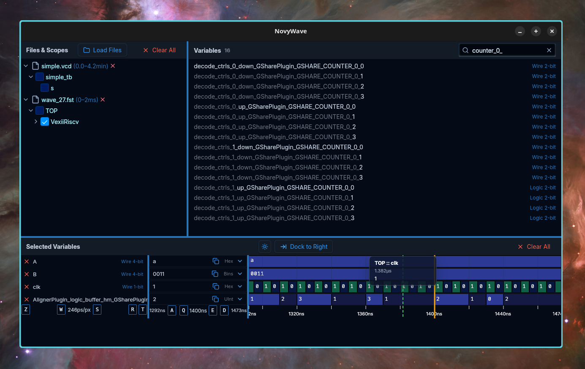

# NovyWave

NovyWave is an open-source waveform viewer designed as a modern alternative to GTKWave.

This cross-platform desktop application is suitable for both professionals and beginners, offering simple installation and a strong focus on user experience. Its goal is to boost productivity and satisfaction among current hardware developers while also attracting new developers and students to the hardware design ecosystem. NovyWave is built on fast and reliable Rust libraries and leverages well-proven web technologies to ensure a consistent look, accessibility, design flexibility, and safe user extensibility via WebAssembly plugins.

## Demo

https://github.com/user-attachments/assets/c5f20ccb-6c49-4e80-943a-3f3ba10dc2af

## Features

- **Multiple Waveform Formats**: VCD, FST, and GHW file support
- **Cross-Platform**: Linux, macOS, and Windows desktop applications
- **Dark & Light Themes**: Optimized color palettes for waveform visualization
- **Flexible Layouts**: Dock panels to bottom or right, resize with drag dividers
- **Keyboard Navigation**: Comprehensive shortcuts for zooming, panning, and cursor control
- **Variable Formatting**: Binary, Hex, Octal, Signed/Unsigned decimal, ASCII display
- **Signal Search**: Filter variables by name with real-time results
- **Multi-File Support**: Load and compare signals from multiple waveform files
- **Scope Browser**: Navigate hierarchical module/scope structure
- **Timeline Cursor**: Click or keyboard-navigate to inspect signal values at any time
- **Smart Labels**: Automatic path disambiguation for files with duplicate names
- **Overflow Detection**: Track counter overflows and special signal states (X, Z, U)
- **Persistent State**: Automatically saves and restores workspace configuration

## Supported Formats

| Format | Extension | Description |
|--------|-----------|-------------|
| VCD | `.vcd` | Value Change Dump - IEEE standard format |
| FST | `.fst` | Fast Signal Trace - GTKWave's compressed format |
| GHW | `.ghw` | GHDL Waveform - GHDL native format |

## Installation

### Pre-built Binaries

Download the latest release for your platform from [GitHub Releases](https://github.com/NovyWave/NovyWave/releases).

### From Source

See [INSTALLATION.md](INSTALLATION.md) for detailed build instructions.

## Keyboard Shortcuts

| Key | Action |
|-----|--------|
| `W` / `S` | Zoom in / out |
| `Shift+W` / `Shift+S` | Fast zoom |
| `A` / `D` | Pan left / right |
| `Q` / `E` | Move cursor left / right |
| `Shift+Q` / `Shift+E` | Jump to previous / next transition |
| `Z` | Reset zoom center to 0 |
| `R` | Full reset (zoom, cursor, viewport) |
| `Ctrl+T` | Toggle theme |
| `Ctrl+D` | Toggle dock mode |
| `Escape` | Close dialogs |

## HDL Examples

NovyWave includes example projects for various hardware description languages:

- **VHDL** - GHDL simulation with GHW output
- **Verilog** - Icarus Verilog simulation with VCD output
- **SpinalHDL** - Scala-based HDL with Verilator simulation
- **Amaranth** - Python HDL with built-in simulation
- **Spade** - Rust-inspired HDL compiling to Verilog

See the [examples/](examples/) directory for complete projects with Makefiles.

## Documentation

- **[Documentation Site](https://novywave.pages.dev)** — User guides, tutorials, and reference
- [Installation Guide](INSTALLATION.md)
- [Contributing](CONTRIBUTING.md)
- [Security Policy](SECURITY.md)

## Contact

Questions → martin@kavik.cz

## Contributing

Contributions are welcome! Please read [CONTRIBUTING.md](CONTRIBUTING.md) for guidelines on:
- Setting up the development environment
- Code style and architecture patterns
- Submitting pull requests

## License

MIT License - see [LICENSE](LICENSE) for details.

## Funding

This project is funded through [NGI Zero Core](https://nlnet.nl/core), a fund established by [NLnet](https://nlnet.nl) with financial support from the European Commission's [Next Generation Internet](https://ngi.eu) program. Learn more at the [NLnet project page](https://nlnet.nl/project/NovyWave).

