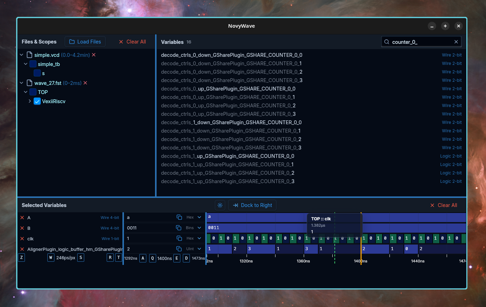

# NovyWave

Open-source waveform viewer for VCD, FST, and GHW files. Desktop app first, with a browser mode when needed.

## Features

**Multi-file comparison** — Load multiple waveform files in one session and compare signals across regression runs, design variants, or separate parts of the system.

**Analog signals** — Real-valued signals are automatically rendered as continuous waveform traces with auto-scaling.

**WASD navigation** — WASD-style controls make zooming and panning fast, with built-in shortcuts for cursor movement and jumping between signal transitions.

**Cross-platform** — Native apps for Linux, macOS, and Windows. There is also a browser mode when running NovyWave locally or on another machine.

**WebAssembly plugins** — Live-reload waveforms and auto-discover new dump files with built-in plugins — or build your own.

**Signal groups and markers** — Organize selected signals into named, collapsible groups. Add labeled timeline bookmarks that persist across sessions.

**Everything else** — Dark and light themes, flexible panel layouts, per-signal row resizing, value formatting (Hex, Binary, Decimal, ASCII), scope browser, signal search, smart file labels, tooltips, workspace picker, persistent state, and auto-update.

## Installation

Download the latest release for your platform from [GitHub Releases](https://github.com/NovyWave/NovyWave/releases). To build from source, see [INSTALLATION.md](INSTALLATION.md).

## Keyboard Shortcuts

| Key | Action |
|-----|--------|
| `W` / `S` | Zoom in / out |
| `A` / `D` | Pan left / right |
| `Q` / `E` | Move cursor left / right |
| `Shift+Q` / `Shift+E` | Jump to previous / next transition |
| `M` | Create named marker |
| `R` | Full reset |

See the [full shortcut reference](https://novywave.pages.dev/user-guide/keyboard-shortcuts/) for all keys including fast zoom, marker jumping, tooltips, and theme/dock toggles.

## Documentation

**[novywave.pages.dev](https://novywave.pages.dev)** — Installation guides, tutorials (VHDL, Verilog, SpinalHDL, Amaranth, Spade), keyboard reference, plugin docs, and API reference.

HDL example projects with Makefiles are in the [examples/](examples/) directory.

## Contact

Questions → martin@kavik.cz

## Contributing

See [CONTRIBUTING.md](CONTRIBUTING.md) for development setup, code style, and PR guidelines.

## License

MIT — see [LICENSE](LICENSE).

## Funding

This project is funded through [NGI Zero Core](https://nlnet.nl/core), a fund established by [NLnet](https://nlnet.nl) with financial support from the European Commission's [Next Generation Internet](https://ngi.eu) program. Learn more at the [NLnet project page](https://nlnet.nl/project/NovyWave).

