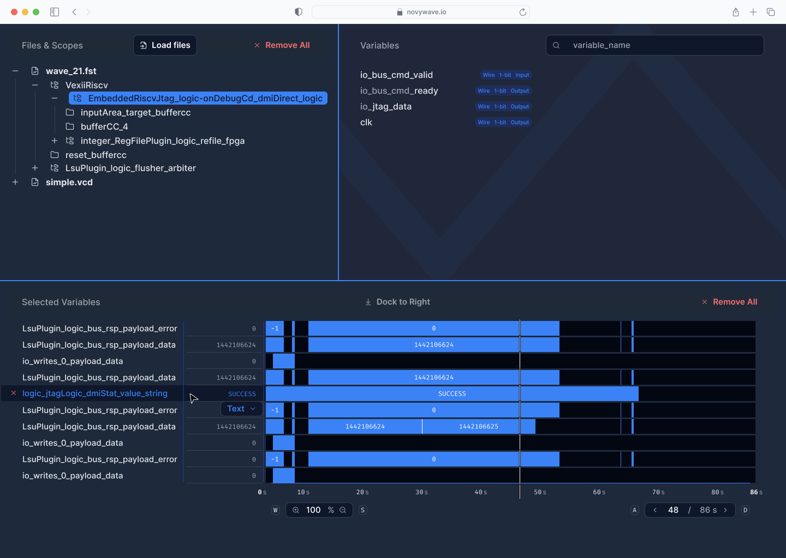
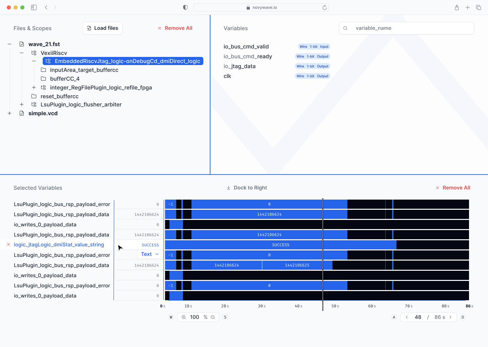
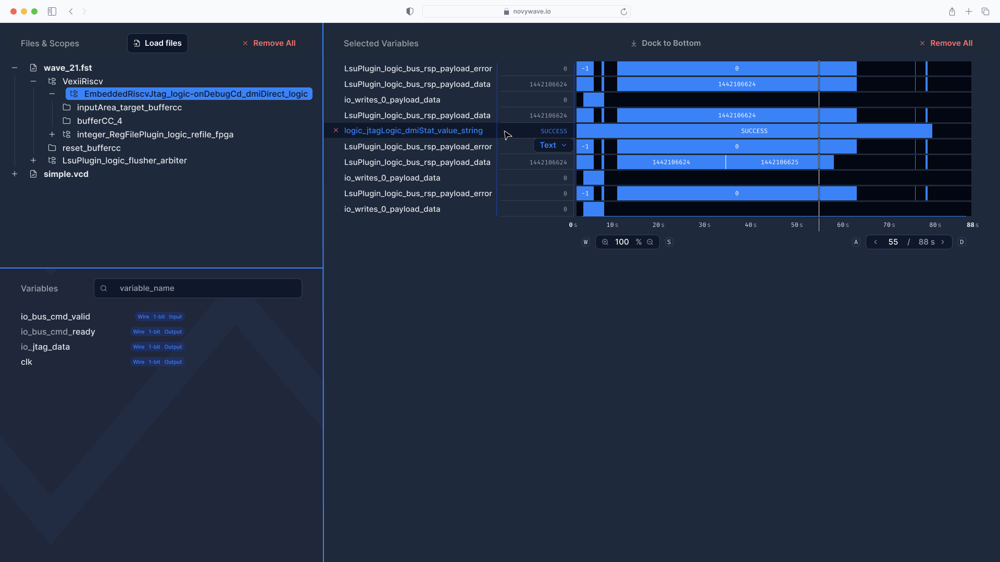
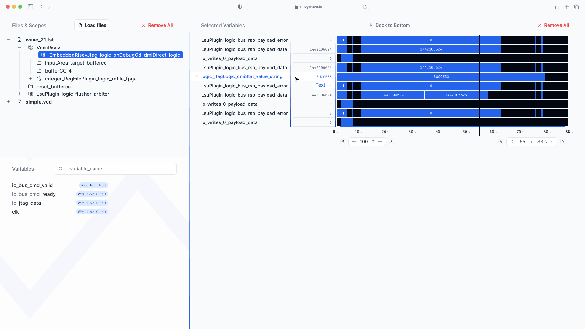
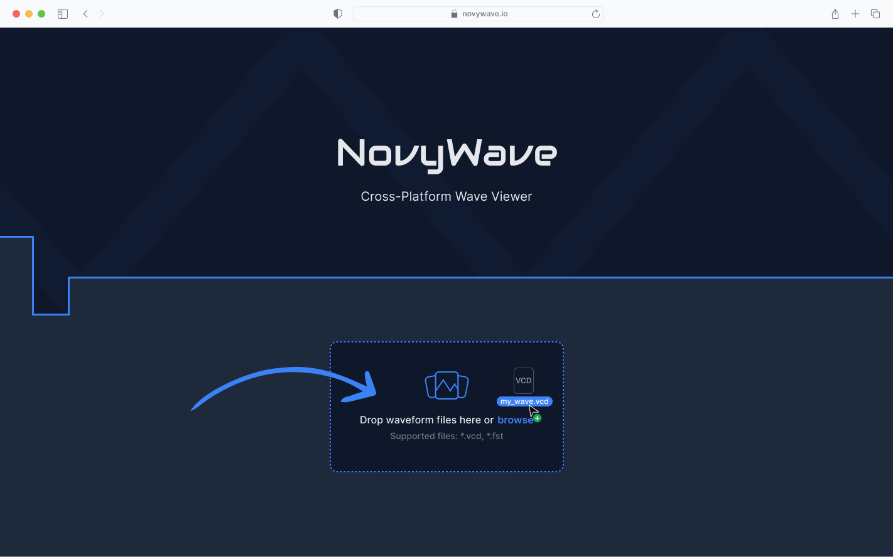
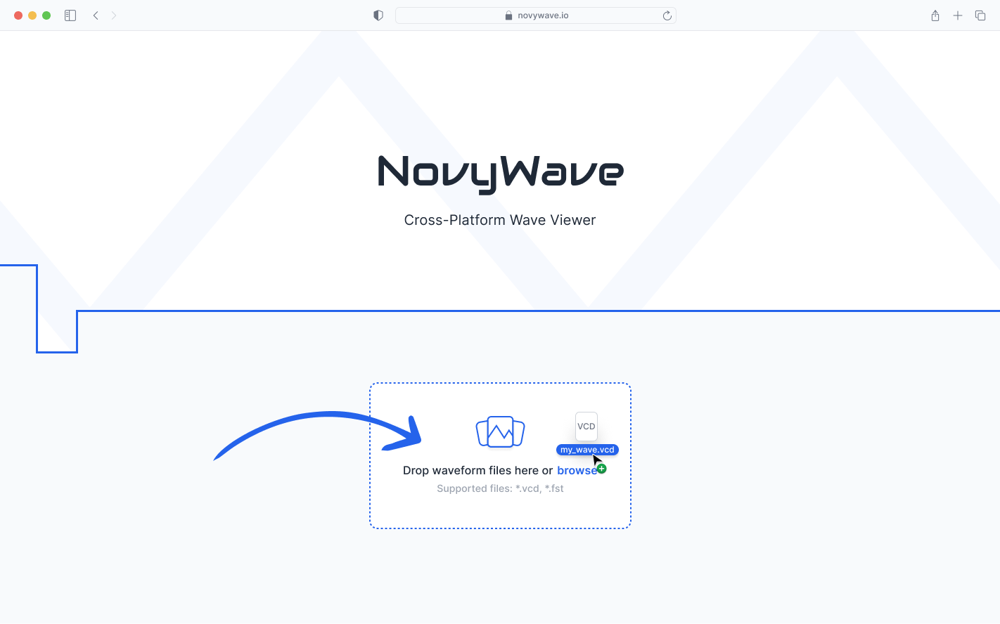

# 🎨 NovyWave Design

## 📖 Introduction

This document contains the design specifications and visual assets for NovyWave, a modern waveform viewer application. The design system includes both light and dark themes across multiple screen resolutions to ensure optimal viewing of waveform data in different environments.

## 📁 Design Files

### 📐 Design Source Files

- **[NovyWave.fig](figma/NovyWave.fig)** - Current Figma design file containing design components and layouts. This will be recreated in PenPot as the future source of truth for collaborative design work.
- **[Common Resolutions (Full HD and Above).pdf](Common%20Resolutions%20(Full%20HD%20and%20Above).pdf)** - Reference document containing analysis of common screen resolutions used by hardware developers, supporting the design decisions for target resolutions.

### 🖼️ Design Mockups

The following mockups showcase the NovyWave waveform viewer interface across different resolutions and themes:

#### 💻 Smaller Resolution (1440x1024)



*Dark and light theme variants for smaller/secondary displays*

#### 🖥️ Full HD Resolution (1920x1080)  



*Dark and light theme variants for primary development displays (most common for hardware developers)*

#### 📄 Empty State Views



*Dark and light theme empty states showing the interface without loaded waveform data*

> **Note:** Empty state views are designed for future implementation and will be added as needed based on user experience requirements.

## ⚙️ Design Specifications

### 📱 Screen Resolutions

The designs are optimized for the following screen resolutions:
- **1440x1024** - Smaller or secondary displays
- **1920x1080** - Primary development displays (most common for hardware developers)

### 🎨 Theme Variations

#### 🌙 Dark Theme
The dark theme provides a modern, professional appearance with:
- Reduced eye strain in low-light environments
- Better focus on content
- Energy efficiency on OLED displays

#### ☀️ Light Theme
The light theme offers:
- High contrast for better readability
- Familiar interface patterns
- Optimal performance in bright environments

### 📝 Empty States

Empty state designs show the interface when:
- No waveform files are loaded
- Data is being processed
- Initial application startup

## 📋 Usage Guidelines

1. **📐 Design Files**: The current Figma file serves as a reference, but designs will be recreated in PenPot for open-source collaboration
2. **🖼️ Reference Images**: Use the PNG mockups for development reference and stakeholder presentations
3. **📐 Responsive Design**: Ensure implementations adapt gracefully between the provided screen resolutions
4. **🎨 Theme Consistency**: Maintain visual consistency when switching between light and dark themes

## 📂 File Structure

```
design/
├── design.md (this file)
├── Common Resolutions (Full HD and Above).pdf
└── figma/
    ├── NovyWave.fig
    ├── figma_dark_1440x1024.png
    ├── figma_dark_1920x1080.png
    ├── figma_dark_empty.png
    ├── figma_light_1440x1024.png
    ├── figma_light_1920x1080.png
    └── figma_light_empty.png
```

## 🚀 Future Plans

The current Figma designs will be recreated in [PenPot](https://penpot.app/) to provide an open-source design workflow that aligns with the project's open-source philosophy. This will enable better collaboration and ensure design files remain accessible without proprietary software dependencies.

> **Note:** The waveform viewer component may evolve significantly during development based on user feedback and technical progress in the [Fast2D library](https://github.com/NovyWave/Fast2D). The current designs serve as initial mockups and will be refined as the underlying rendering capabilities mature.
