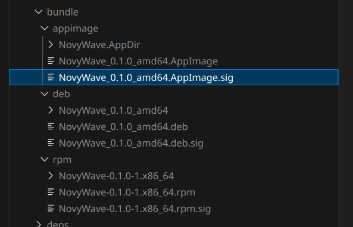
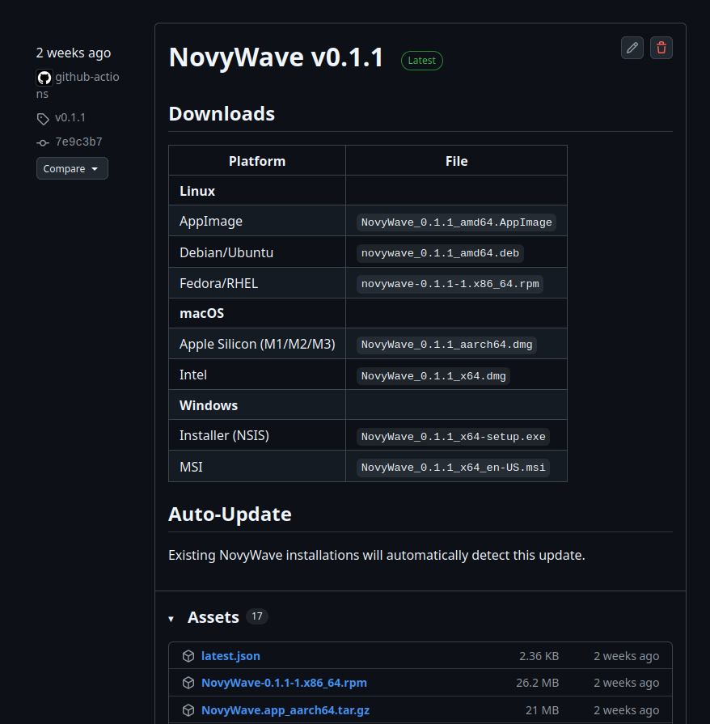
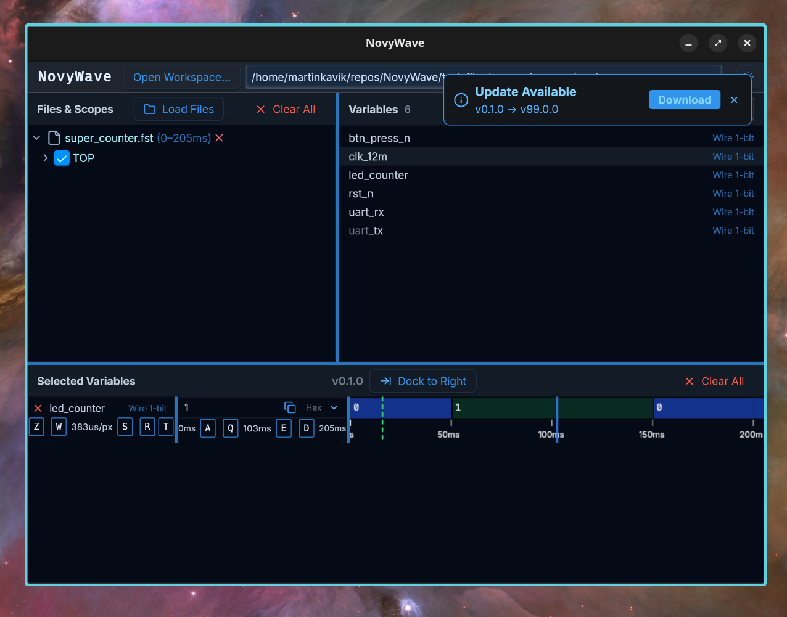
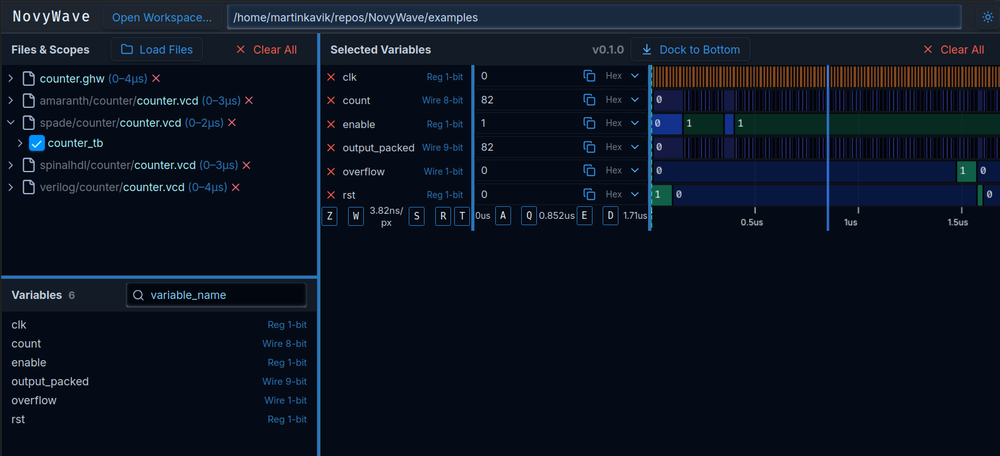

# Task 8: Distribution & Cross-Platform Testing

This task prepares NovyWave for release across Linux, Windows, and macOS by ensuring robust bundling, testing, and delivery processes. It includes manual bundling with platform-specific tests (especially for Linux), finalizing versioning and signing procedures along with documentation, setting up an automated release pipeline, and integrating an auto-updater system.

## 8a. Manual bundling and platform-specific testing

- `makers install`
- `makers tauri-build`
- `cd target/release/bundle`
- `appimage/NovyWave_0.1.0_amd64.AppImage` and other variants for Linux, macOS and Windows depending on where the building is done

Comamnd `tauri-build` also automatically generates `*.sig` file for each bundle so the updater can later verify that the bundle is valid and safe to run. The bundle is signed by a pregenerated dev private key together with a password that are set to corresponding env vars during the build. It allows to build them with the production private key in the CI pipeline.

## 8b. Finalize bundling, versioning, signing, releasing

WIP

## 8c. Set up an automated release pipeline with e.g. Woodpecker.

There is a `.woodpecker.yml` draft, but we have to use GitHub Actions to build for Windows and especially for all needed macOS HWs to make Windows/macOS support sustainable. Also Tauri officially supports GitHub Actions as well, even though we use a custom build becasue MoonZoon has its own build tools.

## 8d. Configure and integrate an auto-updater system

We use official Tauri Updater that automatically verifies downloaded bundles with their `*.sig` files. it uses `latest.json` in release assets to identify a new version. Toasts are displayed in UI when a new version is available. There is a mock server to test the functionality. 

# Task 9: Examples, Documentation & Beta Release

This task is dedicated to providing thorough documentation, sample projects, and a public beta release. It involves launching the beta version, developing example projects for multiple hardware description languages (e.g., Verilog, SpinalHDL, Spade, Amaranth), and preparing comprehensive user and API documentation that helps both users and developers get started quickly.

## 9a. Polish & launch the beta release for early adopters

WIP

## 9b. Develop example projects for multiple HDLs

Counter examples for:

- [Amaranth](https://amaranth-lang.org/docs/amaranth/latest/)
- [Spade](https://spade-lang.org/)
- [SpinalHDL](https://github.com/SpinalHDL/SpinalHDL)
- [Verilog](https://en.wikipedia.org/wiki/Verilog)
- [VHDL](https://en.wikipedia.org/wiki/VHDL)

## 9c. Create comprehensive documentation (user guides, API docs, tutorials, internal notes)

WIP

