# Task 9: Examples, Documentation & Beta Release

[Phase 4: Distribution, Cross-Platform Testing, Examples & Documentation]

## Milestones

### **9c.** Create comprehensive documentation (user guides, API docs, tutorials, internal notes)

Documentation website built with Astro Starlight, deployed to [novywave.pages.dev](https://novywave.pages.dev/).

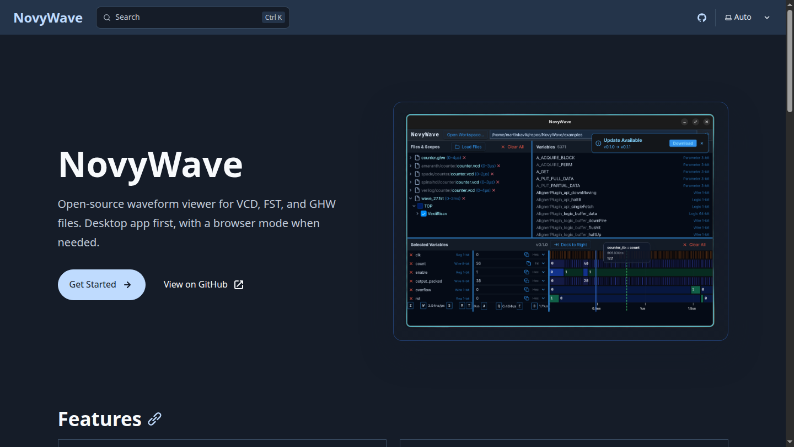

**Getting Started:**
- Installation guides for Linux, macOS, and Windows
- Quick Start guide

**User Guide:**
- Interface Overview, Loading Waveform Files, Supported Formats
- Multi-File Workflows, Timeline Navigation, Zooming and Panning
- Cursor Controls, Signal Values and Formats, Keyboard Shortcuts
- Plugins, Workspace & Configuration, Troubleshooting

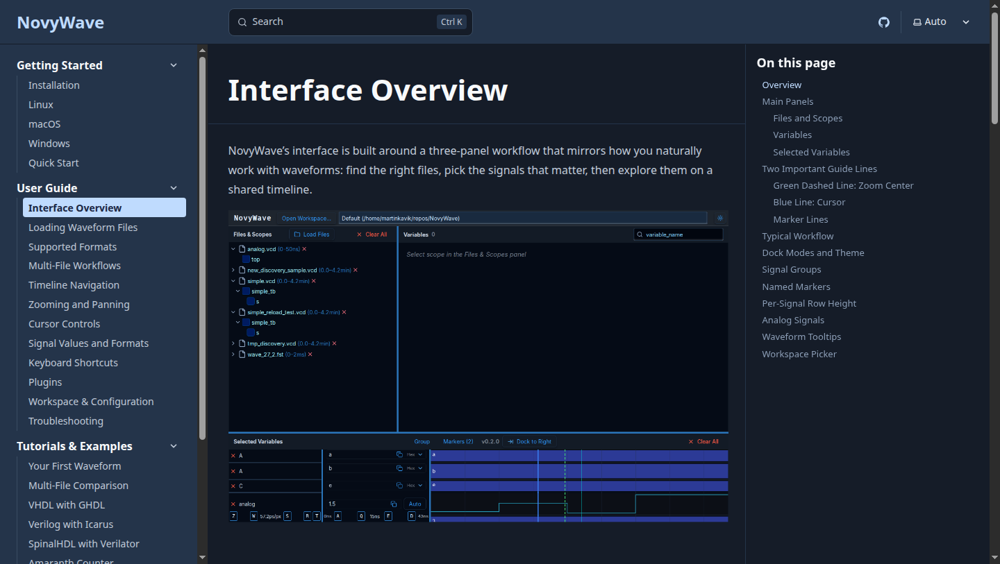

**Tutorials & Examples:**
- Your First Waveform, Multi-File Comparison
- VHDL with GHDL, Verilog with Icarus, SpinalHDL with Verilator, Spade, Amaranth Counter

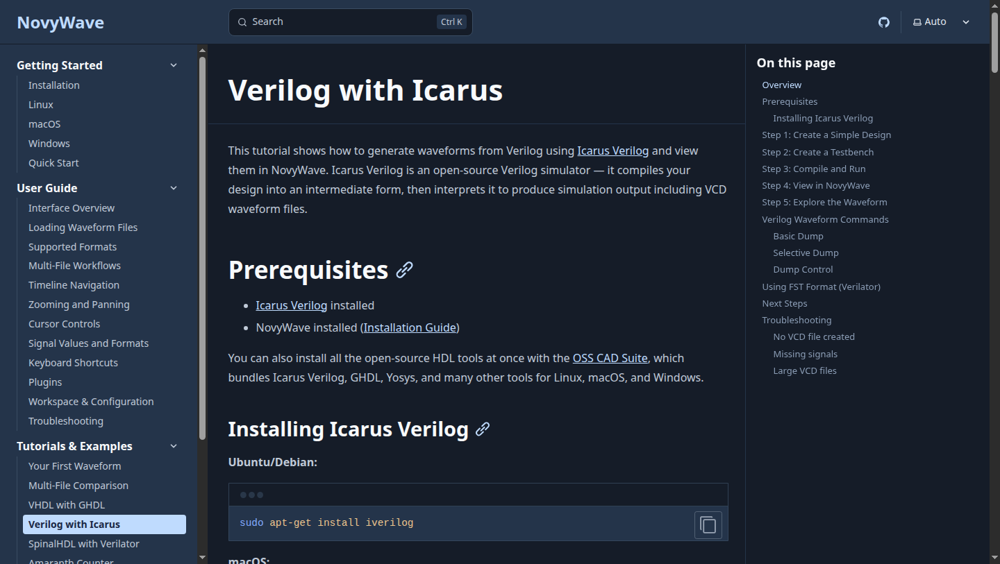

**Development:**
- Architecture overview, Building from source, Testing procedures

**Changelog**

# Task 11: Design Updates and Refinement

[Phase 5: Community Engagement, Design Updates & Final Quality Assurance]

## Milestones

### **11a.** Refine and update the UI components based on feedback + **11b.** Implement design changes, update documentation, and conduct comprehensive testing

The new features and UI refinements are based on user research and feedback gathered in the previous phase. Findings were published in the blog post: [Building NovyWave: GTKWave alternative](https://kavik.cz/blog/novywave-user-research-waveform-viewers/).

**Full UI overview** showing the new features in context:
- **Signal groups** — variables can be organized into named collapsible groups (bottom-left: "My Group (3)" with variables A, A, C)
- **Named markers** — labeled timeline markers added with the M key, with jump navigation (bottom: "Marker 1" and "Second Marker" on the timeline axis)
- **Analog signals** — continuous waveform rendering with hover tooltip showing signal path, timestamp, and value (waveform canvas: "top :: analog" with curve visualization)
- **Resizable signal rows** — selected variable rows can be resized to accommodate especially analog signal visualization

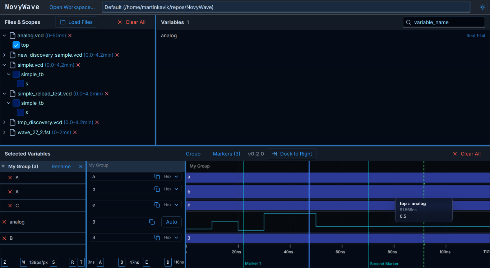

**Create Group dialog** for organizing selected variables into named groups:

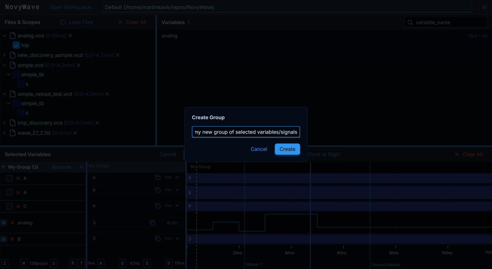

**Markers management dialog** with numbered markers, Jump/Save/Delete actions, shown in both dark and light theme:

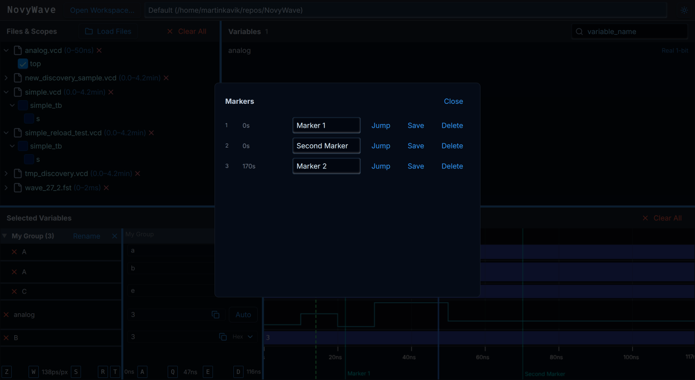

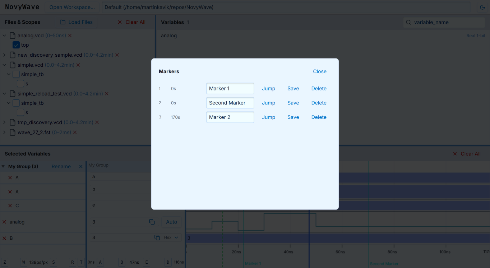

**Analog waveform rendering** with hover tooltip:

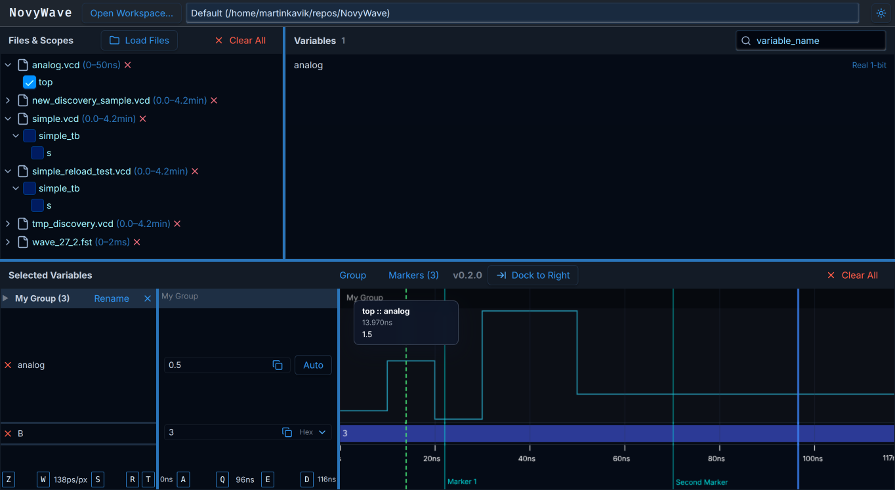

**Analog Limits dialog** with Auto range and Manual range modes for setting Y-axis bounds:

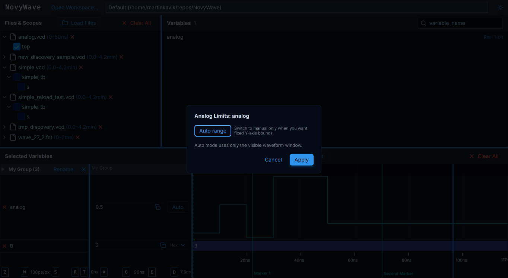

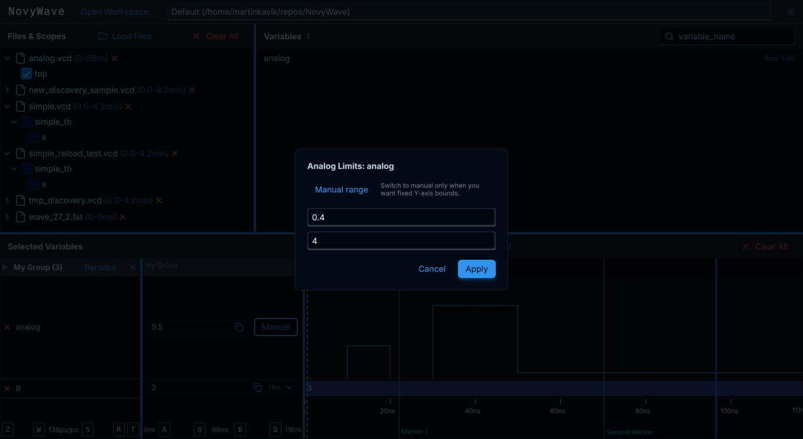

**Analog Manual limits applied** — waveform scaled to user-defined Y-axis bounds:

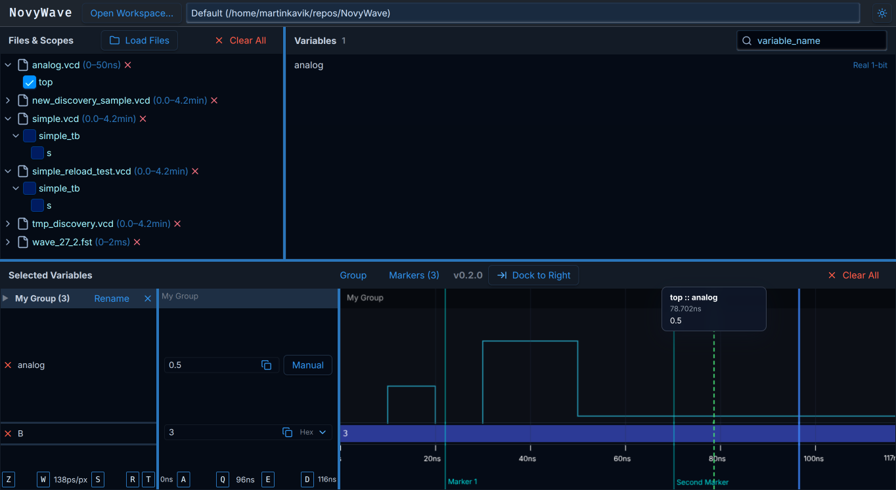

# Bonus: Chrome Launcher & Release Pipeline

A Chrome-based version (`novywave-chrome`) has been added as a lightweight alternative to the standard desktop app. It opens NovyWave in Chrome/Chromium app mode, which provides better performance especially on Linux. Chrome launcher binaries are included in the v0.2.0 release for all platforms (Linux, macOS arm/Intel, Windows).

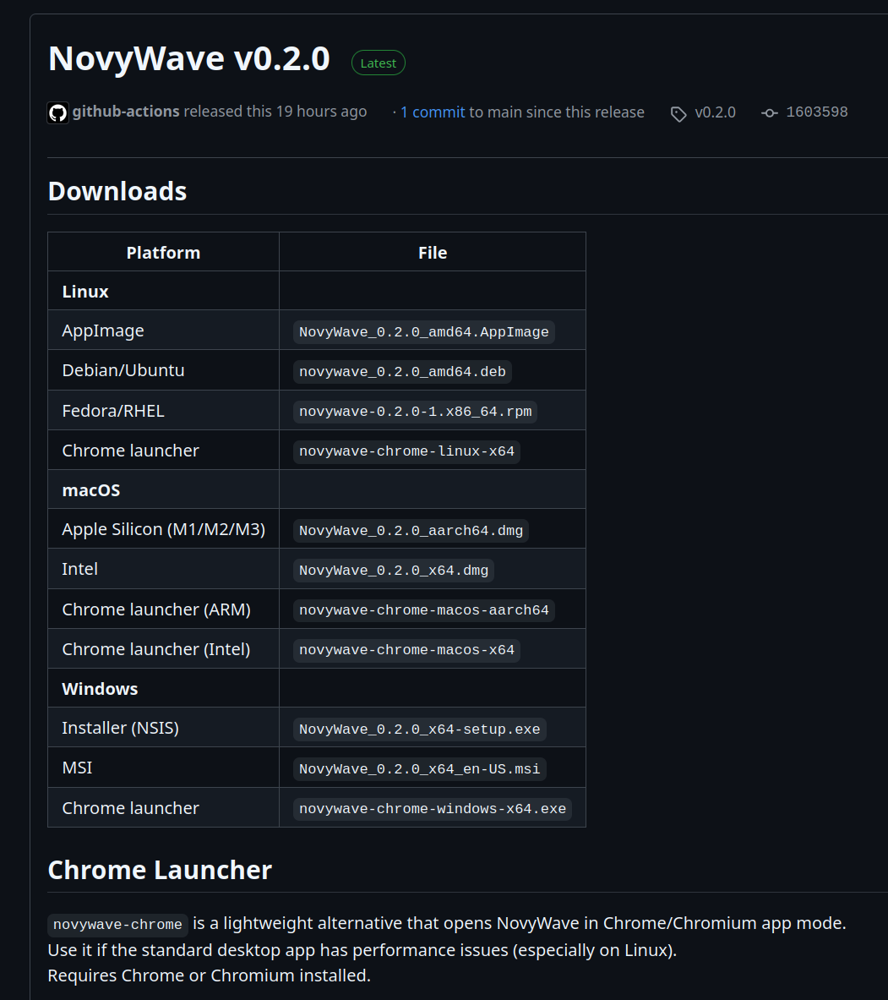

Cross-platform release pipeline via GitHub Actions building for Linux (AppImage, deb, rpm), macOS (arm, x64), and Windows (NSIS, MSI), plus Chrome launcher for all platforms. The release workflow has been updated with better naming, automatic version verification and extraction from code:

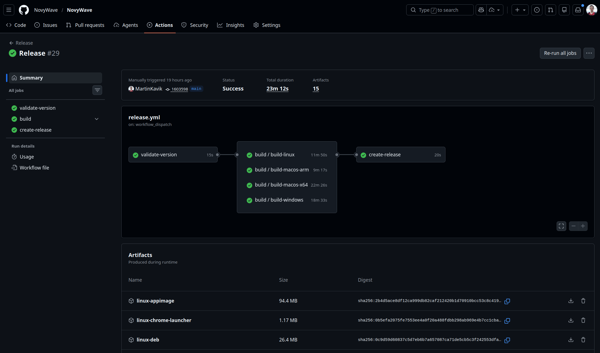
