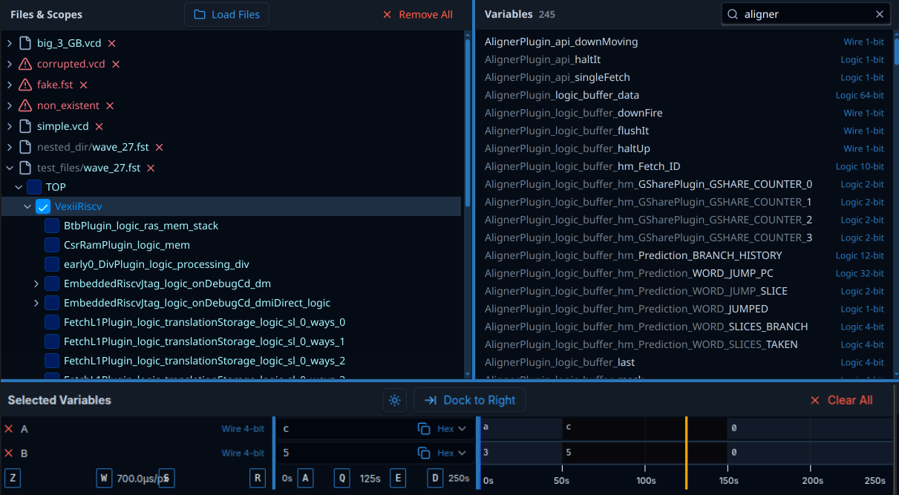
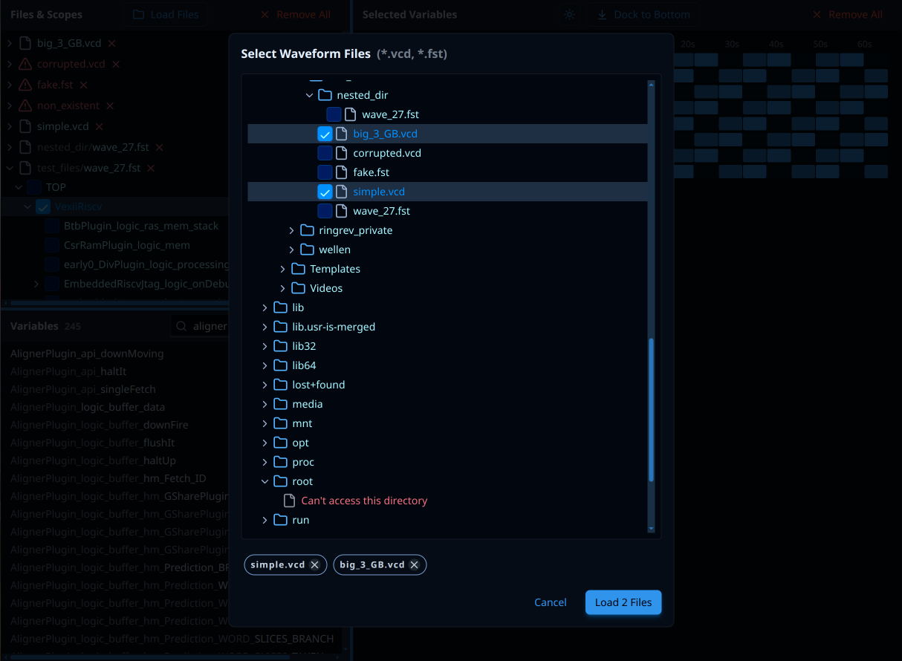
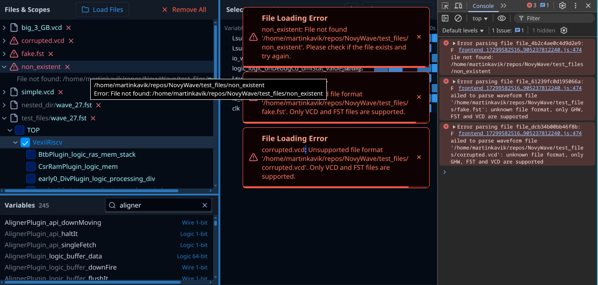

# NovyWave Specifications

NovyWave is an open-source waveform viewer designed as a modern alternative to GTKWave.

This cross-platform desktop application is suitable for both professionals and beginners, offering simple installation and a strong focus on user experience. Its goal is to boost productivity and satisfaction among current hardware developers while also attracting new developers and students to the hardware design ecosystem. NovyWave is built on fast and reliable Rust libraries and leverages well-proven web technologies to ensure a consistent look, accessibility, design flexibility, and safe user extensibility via WebAssembly plugins.

# Layout and Styles

The layout consists of 3 panels divided by draggable lines. "Files & Scopes" panel at the top left corner, "Variables" panel in the top right corner, and "Selected Variables" panel at the bottom. Users can drag the draggable divider lines with their mouse cursors to resize panels (tiling).

The layout can be changed by clicking button "Dock to Right" as follows: "Files & Scopes" panel does not move at all, "Variables" panel move to the left bottom corner below "Files & Scopes" panel and "Selected Variables" panel move to the rigth side - it will be _docked_ along whole right edge of the window.

After clicking on button "Dock to Right", the button label will change to "Dock to Bottom" - after clicking it again panel will move to the default layout - user can toggle layouts/docking with this button or by pressing Ctrl+d.
The button is placed in the "Selected Variables" panel header. 

Dragging should work the way that after clicking on a draggable line a transparent overlay is rendered over entire window and that overlay listens for mouse events to prevent accidental content selection and it makes the algorithm simpler and more reliable in general.

Both dock mode (right/bottom) has to be stored together with dividing bar positions (individually for each dock mode) in .novywave on each dock mode change or resize (debounced properly).

All panels have thin inside scrollbars (both vertical and horizontal as the content dictates) and all containers and elements have minimal paddings and sizes to accomodate many waveform variables with long names and to provide as much information to the user as possible at once to help with debugging effectively. Sans-serif font(s) for most parts of application, monospaced font(s) for waveform variable values and inside canvas with waveform visualizer.

Dark and light themes are supported. The dark one is the default and they are switched by other clicking Theme Button in the Selected Variables panel header or by pressing shortcut Ctrl+t.

# Files & Scopes Panel

## Header

Title "Files & Scope" aligned left, "Load Files" button with a folder icon in the center and "Remove All" button with "x" icon aligned right.

"Remove All" button clear the panel content by removing all loaded files. A standarized (the same for all empty states in all panels) placeholder text like "Click Load Files and choose files to open" appears.

"Load Files" button opens file picker (described below in section "Load Files Dialog") to pick VCD, FST and GHW files. After succesful selection (1 or more files), the files will be loaded and displayed in the panel content as described below. For debug pursposes, file picker should open in `test_files` folder by default.

## Content

Panel content display a tree view with loaded files as roots. Loaded file is a file parsed by Wellen library. File labels in the tree view are formatted this way: "[chevron pointing right or down if expanded] [file icon or warning icon if parsing failed] [file name with extension, prefixed with path long enough to distinguish different files with same names] [timespan with units, e.g (0-250s)] ["x" remove (unload file) button]".
In case of loading error (file not found, parsing failed, not accessible, file not supported, etc.) the error message show be displayed as a tooltip on mouse hover together with absolute path to the file. Succesfully loaded files will have tooltip as well, but with just their absolute path. Files will be identified through entire app by their absolute paths.
Extra file path prefixes will have less contrasting colors than the filenames.
Files with loading errors will have differnt color as well. Timespan will be less contrasting than filenames.

Just after selection, file ids (absolute paths) shoud be stored in entire app configuration that is automatically stored and restored from .novywave file saved in the project root (currently, for debug and development purposeses), as TOML. The same config state and file wil be used for many other app state (selected theme, dock mode, panel sizes, etc.) so config handling should be centralized and performant to accomodate all changes and all config states. .novywave file should be read on app start and found loaded files should be automatically reloaded and placed in the panel content the same way as if they would be seleted by user through file picker manually.

Every file (tree view root item) can be expanded and display hierarchy of scopes as parsed by Wellen library. Expandable scopes (the one having at least one child scope) have dispalyed chevron icon just like files. Then the label contains bigger checkbox for easier pointer targeting. Only one checkbox may be selected in entire tree view and the corresponding selected scope is store in our .novywave file throuigh our central config handling with scope id, that has format "[absolute file path]|[scope parent]|[scope]". Expanded files and scopes are stored in config files similarly and restored properly after app restart. Scope is expanded by clicking everywhere on its label/row, excluding the checkbox (it's the only element toggling scope selection).
Files are ordered first by name then by unique prefix path (if present), scope are ordered just by name.
Panel content has to be scrollable both vertically and horizontally to acommodate deep scope hierarchy with often long names.

# Load Files Dialog

Load Files Dialog appears after clicking on Load Files button in the Files & Scope Panel header.

It's a modal dialog with semi-transparent overlay as the background behind the dialog window alone. Clicking on the overlay or pressing Esc key will close the dialog without any changes, similary to pressing button Cancel on the dialog alone.

The dialog consists of 4 parts:

## Header
Title "Select Waveform Files" with less contrasting "(*.vcd, *.fst, *.ghw)". There may be X button to close the modal but it's not necessary.

## Content
Scrollable content "window" with file tree view inside. It uses the same view component like the one that is used in the Files & Scope panel but the behavior is different.
The treeview represents basically standard file structure, where items are either directories or files or special placeholders described below.
Scroll position is remembered in .novywave file. Saving the position has to be debounced either directly in the listener or globally in the centralized configuration handling to prevent excessive configuration saving to the file. Restoring the scrolling position may be tricky because of timin issues casued by rendering in browser DOM and loading data for the tree view alone.

### Directories
Item has format "[chevron right/down] [directory icon] [directory name]". The are expanded or collapsed on clicking anywhere or them or maybe even on the entire row that represents their containers. The tree starts with `/` in Linux and similar root or roots defined by their operating systems. Every expanded directory is remembered in .novywave configuration file. By default - if it's first dialog opening ever - home (~ or equivalent folder) is expanded togetger with it's ancestors to make it's content visible for the user. 

### Files
File items have this layout and label: "[checkbox] [file icon] [filename]". Clicking anywere on the entire item row will toggle the checkbox and make the file item higlighted. Only supported file types are filtered and listed below their expanded parent directory. 

### Placeholders
There are 3 cases when no files can be listed in the expanded directory and the reasons has to be shown to the user as an actual files item placeholder but with different colors and icons and without the checkbox:
1. The directory is just empty - show reasonably icon and text "Empty", no contrasting colors to not be confused with actual files.
2. There are files, but none of them are supported - show the similar placeholder like for the case of empty folder, but differnt wording like "No supported files".
3. Some folders are inaccessible becasue of misssing permission or other problems. Then we should display more contrasting (preferably red) text like "Can't access this directory".

## Selected Files
Selected (checked files) appear in the row below the Content as Tags styled as pills with X button inside. Clicking X button make the Tag disappear and automatically uncheck corresponding file in the tree view above. An HTML tooltip with absolute path is displayed on mouse hover over the Tag.

## Control Buttons

There are two button aligned to the right in the right bottom corner of the dialog. Cancel button and a confirmation button with label like "Load 2 Files" that is disabled until at least one file is checked/selected. 

# Variables Panel

## Header

Variable panel header consists of standard panel title with label "Variables", less-contrasting number of variables in the selected scope and filter/search text input. Text input has layout "[magnifying glass icon] Variable name... [X icon]". Variables are filtered on each input change. Filtering is case-insensitive and the searched term may be substring anywhere inside variable names. Variables number is refreshed according to the filtered results count.

## Content
There may be thousands of variables in one selected scope so rendering of such list has to be very performance optimized - virtual list or similar model has to be used. Every line in the list of variables displayed in Variables panel content has simple textual content but coloring is bit more complex. The content alone is just variable name aligned to the left and it's type (e.g. Wire 1-bit or Logic 32-bit aligned to the right). Every item has to have constant height (to make virtual list implementation simpler and faster) so no item/text wrapping is alllowed, panel horizontal scrollbar will be often display to accomodate long variable names.
Type are rendered with smaller fonts with non-contrasting (preferably blue-ish) color.
Variable names are sorted by name and common prefixes are greyed-out in following items in the list. Example: variables AB, ABC and ABCD will be displayed: AB, (AB)C, (ABC)D where prefixes in () are grey-out for simpler scanning by the user.
Items are highlighted on mouse hover and also when they are selected. User may select multiple variables by clicking on their corresponding items (entire row). Variables may be already preselected on app start because variables ids are stored in .novywave file.
When there are no variables standarized placeholder texts like "Selected scope does not have any variables" or "Select scope in the Files & Scopes" panel should appear.

# Selected Variables Panel

## Header

Standard title with label "Selected Variables" aligned to the left, centered control buttons group and "X Remove All" button (same like on the Files & Scopes header) aligned to the right.

There are two control buttons. Theme button shows icon of sun in dark mode and icon of half-moon in light theme. There is no text on the Theme button. The second button has icon and text. When Selected Variables panel is docked to the bottom, its icon is an arrow pointing to the right to a vertical line and its text is "Dock to Right". When it's docked to the right, the icon is an arrow pointing down to the horizontal line and the label is "Dock to Bottom".

"X Remove All" button just removes all selected variables and the content below is replaced by a standard placeholder like "Select variables in the Variables panel".

## Content

Content consists of three columns: "Name Column", "Value Column" and "Wave Column". Wave Column is an HTML Canvas controlled by the Rust crate Fast2D. There are draggable bars between them just like between panels. .novywave remembers their positions individualy for both dock modes. Column are described below.
Every Column is a list of rows representing individual selected variables. Every row has the same height and the height is the same for every column. It means there are three columns, but it's basically a table. Every Colum has a footer - an extra row.

### Name Column
Each row consists of "X" button to remove the selected variable, variable name and type. Type is styled and aligned the same like the types in Variables panel.
Hovering over the row shows HTML tooltip with variable's ID consisting of absolute file path and scope hierarchy.
Footer consists of 4 Kbd Elements and a dynamic text representing current zoom. The layout of the footer is defined this way: |[Z]    [W] 15ns/px [S]    [R]|. Where Z has HTML toolip like "Press Z to move zoom center to 0"., W tooltip like "Press W to zoom in. Press Shift+W to zoom in faster.", S tooltip like "Press S to zoom out. Press Shift+S to zoom out faster.", R tooltip like "Press R to reset to default zoom center, zoom and cursor position.". Pressing keys does exactly what the tooltips say, there are only ignored when an input (e.g. search/filer variables input) has focus. Current zoom is displayed as "[number][time unit]/px" (e.g. 15ns/px) but we can consider better alternatives in the future to improve UX but we have to take into account that zoom scales from nanoseconds to hundreds of seconds. 

### Value Column
Each row is basically a Select/Dropdown element. Its collapsed dropdown (the row content / dropdown header) displays formatted variable value aligned to the left and group of three elements aligned to the right: copy-to-clipboard button (just copy icon, does not allow click event to pass through the dropdown), formatter name (Hex, Bin, .., described below), chevron icon signaling that it's clickable dropdown element.

Supported formats:
1. ASCII ("Text")
    - Converts 8-bit binary chunks to ASCII characters
    - Useful for displaying text data in waveforms
2. Binary ("Bin")
    - Raw binary display (1s and 0s)
    - Direct representation of the signal value
3. BinaryWithGroups ("Bins")
    - Binary with 4-bit grouping separated by spaces
    - Example: 1101 0011 1010
    - Improves readability for long binary values
4. Hexadecimal ("Hex") - Default format
    - Converts binary to base-16 representation
    - Uses convert_base library for conversion
5. Octal ("Oct")
    - Converts binary to base-8 representation
    - Less common but useful for certain applications
6. Signed ("Int")
    - Interprets binary as signed integer using two's complement
    - Handles negative numbers correctly
7. Unsigned ("UInt")
    - Interprets binary as unsigned integer
    - Always positive decimal values

All formats/formatters are loaded from .novywave file, where the selected formatter is stored together with other selected variable metadata. If no data regarding type/formatter is used, then the default one is used.

User can choose different formatter by clicking on the row to expand its dropdown menu and then choose formatter by clicking on a dropdown menu option. Each option is a row with formatter label ("Text", "Bin", "Hex", ..) aligned to the right and the value formatted by that particular formatter aligned to the left. If it isn't possible to display formatted value (e.g. treat too short value as ASCII/Text) then low-contrasting char '-' or similar placeholder should appear instead of the value in the option row and. The formatter change will trigger rerender in Wave Column where all displayed values for the given variable should be reformatted with the newly chosen formatter.
When there are no data - timeline cursor points outside of the timespan where no waveform values have been simulated - then low-contrasting "N/A" should be displayed as another kind of placeholder instead of a real formatted value.

Before rendering, minimum and maximum timeline span boundaries have to be determined. First, gather set of waveform files that have at least one variable currently selected. Then, get their spans and units (it should be already cached somwhere because we need these data in Files & Scopes panel to show spans of all loaded files). From those span extract the left (minimum) boundary (typically just 0) and right boundary (maximum) (e.g. 16ns or 250s). These values determine also default/reset state, examples:
A) 0-16ns => minimum 0ns, maximum 16ns, cursor position 8ns (in the center), zoom center 0, visible timeline part: 0-16ns;
B) 0-250s => minimum 0s, maximum 250s, cursor position 125s, zoom center 0, visible timeline part: 0s-250s
C) 6ms-1s => minum 6ms, maximum 1s, cursor position 497ms, etc.
Displayed units should be adequate to displayed number (perhaps only seconds in example C) would be better), but ideally same (but for examples seconds displayed in nanoseconds will brake layout).

Footers layout looks like this: 
|0s [A]    [Q] 125s [E]    [D] 250s|
where:
- 0s is minimum tracked value (left boundary). Refreshes automatically according to the set of files with currently selected variables.
- [A] is Kbd element similar to ones in the Name Column footer, with HTML tooltip "Press A to pan left. Press Shift+A to pan faster."
- [Q] is Kbd element with tooltip "Press Q to move cursor left. Press Shift+Q to jump to the previous transition."
- 125s is current timeline cursor position. It's in the center of the min+max boundarie by default, but remembered in .novywave and moved by clicking mouse on the timeline or by pressing (Shift+)Q/E keys.
- [E] is Kbd element with tooltip "Press E to move cursor right. Press Shift+Q to jump to the next transition."
- [D] is Kbd element with tooltip "Press A to pan right. Press Shift+D to pan faster."
- 250s is maximum tracked value (right boundary). Refreshes automatically according to the set of files with currently selected variables.

Data loading to Value Column is a bit more complex. Selected variables have to be read to know how many rows/dropdown to create and also what formatters set for them. Left/right boundaries (values and units) are determined from loaded/tracked files. Cursor value is either loaded from .novywave or set to the center between those boundaries. Unit is chosen for it adequately. All these values changes reactively according to the current app state. Values should be formatted real-time, no caching of formatted values at all. Most of the time, timeline cursor is inside visible part of the timeline, so just reuse already loaded decimated data for timeline visualisation, no need to request backend for extra data. If cursos is outside of visible timeline, request values from backend in batches (for all selected values at once) and throttle requests to not spam backend with dozens requests on moving cursor by holding Q/E keys or any similar "smooth" moving.

### Wave Column
This is the most complex and performance-sensitive part of the app. All objects in Wave Column are drawn to Canvas controlled by Fast2D library.
A list of rows with height the same as other column rows are rendered, each representing variable value transitions in time displayed as blocks with formatted values inside them and alternate background to distingusih them visually. One row could look like "|[a      ][c           ][0    ][N/A   ]|" where N/A is low-constrasting placeholder for place on the timeline where we don't have data for the given variable available (they are not in its file at all because simulation ended sooner).

Footer looks like this: "|0s  '50s  '100s  '150s  '200s  250s|" from start - fit-all for left boundary 0s and right boundary 250s. Ticks (') should be above the related numbers. When we zoom in and pan, the same timeline may change to something like "|20ns '25ns  '30ns  '35ns  '40ns   45ns|" (notice different values, different units and different spacing between non-ticked/edge numbers and the rest of them). Edge numbers represent left and right boundaris of visible part of the timeline. They are always present and keep distance from their respective timeline edge. "Ticked" values moves together left and right and changes according to panning and zooming. Their count fluctuate accroding to the available space that change when, for instance, canvas alone is resized to fill remining empty space when the window alone is resized or when dock mode is changed. They should have equal gaps among them and they appear or disapear when they are too far or too close to edge values to prevent overlapping.

There are two extra elements displayed on the canvas. The first one is yellow vertical line crossing all rows and footer representing timeline cursor. It's location is controlled by keyboard (as described above) or by mouse - it jumps where the mouse has been clicked. The second one is purple vertical dashed line crossing all rows and footer just like the previous one. This one represents zoom center. It's "parked" by default in left boundary (0 in most cases) and either controlled by keyboard (as described above) or following mouse position when mouse is hovering over timeline (canvas). It's default position is on the left (0) becasue it's the point where all variables from differently timescaled files align most of the times so then zooming in many magnitudes is metter of just pressing Shift+W to zoom in fast.

There are three important things to take into account regarding performance and reliability:
1. We should only request and cache data for currently visible part of the timeline.
2. Data have to be decimated, no need to request more value transitions that would be rendered as the one same pixel. But we still have to display important transitions - e.g. let's say we have timeline 0-250s, where almost everywhere the value is 0 but we still want to see that nanosecond transition to 1 and back to 0 somwhere in the middle of the timeline - it should be displayed as at least 1px wide block to be clearly visible by user to know there is an important transition.
3. We'll operate on the scale from nanoseconds to many seconds (or maybe even smaller and bigger units) in one timeline. Combination of f32 with many divisions and number casting in our zoomin/panning/mouse-to-timline-position algorithms would lead to precision lose and introducing bugs. Better alernative is to use f64 or even u64 with suitable algorithms (e.g. keep all values as nanoseconds).

## Error Handling

Every error has to be logged to either browser console or server error. Errors are presented to users directly in the context of elements they are working with - e.g. altered visuals of file tree view items when directory is in inaccessbile or waveform file cannot be parsed, or/and errors are displaye in form of Toast elements - popups stacked from the top right corner. They are smaller red panel displayed in front of all other elements (including modal dialogs).
Each such window has a thin border, rounded corners and casting a shadow. It consists of warning icon, error title, error message, X button and progressbar. Progressbar is thin, integrated to the bottom edge of the window. Progressbar starts fully filled and then getting empty to the left direction. When it's empty, the window/toast is dismissed. The duration before dismissing is set in .novywave. Counter can be paused by clicking on the toast and resumed with another click - this behavior is described in window's HTML tooltip.